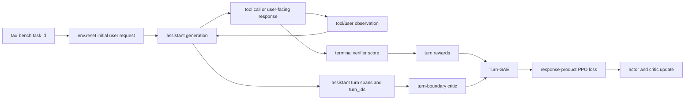

# Turn-PPO for Long-Horizon Tool-Using Agents

[](https://www.python.org/downloads/)
[](https://pytorch.org/)
[](https://developer.nvidia.com/cuda-downloads)
[](LICENSE)

> Strict Turn-PPO adaptation for long-horizon, multi-turn, multi-tool agents on
> tau-bench airline. One complete assistant response is one MDP action; the
> critic, GAE recursion, importance ratio, PPO clipping, and actor objective are
> all evaluated at turn granularity.

This README describes the audited `codex/turn-level-reward` implementation as
of [`a39d8c3`](https://github.com/iOPEN-Xing/agentic-rl/commit/a39d8c36611b8989b3ab95560b931386faeb2c58)
plus the evaluation-contract corrections documented below.  The implementation
and CPU contracts are complete.  Controlled training results are intentionally
left as `TBD` until the full comparison is finished.

## Status

| Area | Status | Evidence |
| --- | --- | --- |
| Turn-MDP rollout identity | Implemented | Every assistant generation becomes one validated, contiguous `turn_id` span |
| Turn-level critic and GAE | Implemented | Values are read at turn starts; GAE recurs over turns |
| Turn-level PPO actor loss | Implemented | Response log-ratios are summed, exponentiated, and clipped once per turn |
| Native tau-bench terminal reward | Implemented | Intermediate rewards are zero; the final assistant turn receives the terminal score |
| Policy/infrastructure failure separation | Implemented | Policy errors remain trainable; infrastructure-failed trajectories receive a zero response mask |
| Independent checkpoint evaluation | Implemented | Matching configs for steps 50, 100, 150, and 200 |
| Controlled Turn-PPO vs GRPO results | Pending | Result tables below are placeholders, not claims |

## Why Turn-PPO

Standard outcome-only GRPO assigns one trajectory-level advantage to every
assistant token. In a long tool trajectory, a correct search turn and a later
incorrect write turn can therefore receive the same update direction.

Turn-PPO changes the decision unit:

```text
state s_t = full interaction history + latest user/tool observation
action a_t = the complete assistant generation at turn t
reward r_t = 0 for t < T; native tau-bench terminal score for t = T
```

The critic estimates value only at real interaction boundaries:

```text
delta_t = r_t + gamma * V(s_{t+1}) - V(s_t)
A_t = delta_t + gamma * lambda * A_{t+1}
```

The same `A_t` is broadcast to all assistant tokens in turn `t`, but different
turns can receive different advantages. The actor computes one response-level
ratio per turn:

```text
rho_t = exp(sum_k(log pi_new(a_tk | .) - log pi_old(a_tk | .)))
```

PPO clipping is applied once to `rho_t`. Turn surrogate losses are summed,
normalized by the trajectory's assistant-token count, and then averaged across
trajectories. This is not token-level clipping with a turn label attached.

## End-to-End Data Flow



The parquet row is only the task entry point. The first real user request is
returned by `env.reset()` and merged into the prompt before generation. Later
user messages and tool observations remain in the causal context but use
`response_mask=0` and `turn_id=0`; only assistant tokens are optimized.

## τ-bench Airline Case

Consider a task that requires reading a reservation, confirming which passenger
is affected, changing only the outbound flight, preserving the return leg and
reporting the result.  A possible trajectory is:

```text
turn 1: get_reservation(...)                 → valid reservation observation
turn 2: search_flights(...)                  → candidate flight observation
turn 3: update_reservation_flights(wrong id) → tool error or wrong state
turn 4: recover and issue the correct update → terminal verifier success/failure
```

Outcome-only GRPO gives every assistant token in this trajectory one scalar
advantage.  Turn-PPO instead learns `V(s_t)` immediately before each assistant
decision.  If the critic is calibrated, the valid read and search can receive
different advantages from the wrong write, even though only turn 4 receives a
nonzero environment reward.  The distinction is created by Turn-GAE bootstrapping
over state values; the code does not pretend that τ-bench supplies native dense
turn rewards.

This fits τ-bench particularly well because every tool observation creates a
causal state boundary and assistant messages are already explicit actions.  It
does not solve reward semantics automatically: a binary final verifier still
limits critic quality, and the critic may learn shortcuts based on turn index,
tool type or response length.  Held-out value calibration and matched
counterfactual trajectories are therefore acceptance requirements.

## Rollout and Failure Correctness

The gray-validation update is deliberately focused on rollout correctness,
failure attribution, and evaluation semantics:

1. **Initial-state contract**
   - Appends the reset observation when the dataset does not already contain it.
   - Fails loudly when a pre-existing initial user message disagrees with the environment.

2. **Terminal-state correctness**
   - Stops after a tool transition reports `done=True`.
   - Does not generate an extra assistant response from a terminal environment.

3. **Policy error attribution**
   - Retains malformed Hermes tool calls as diagnostic actions instead of silently dropping them.
   - Records invalid JSON arguments and unknown tool names in `action_history`.
   - Treats those actions as trainable policy errors because they are attributable to the model.

4. **Infrastructure failure isolation**
   - Marks tool runtime, interaction, finalization, and scoring failures as `valid_for_training=False`.
   - Applies a zero response mask so failed infrastructure contributes no reward, advantage, actor gradient, critic target, or GRPO group statistic.

5. **PRM-Lite observability correction**
   - Applies a direct `-0.10` process penalty to invalid actions.
   - Under the historical `outcome + 0.3 * process` formula, an isolated invalid action changes the total reward by `-0.03` before other rules.
   - This correction is for PRM-Lite ablations. The strict Turn-PPO configuration keeps PRM-Lite and heuristic turn reward disabled.

6. **Metric semantics**
   - Separates any-success rate, `pass@k` (at least one success), and `pass^k` (all `k` successes).
   - Adds exact combinatorial estimators and regression tests.
   - Adds evaluation configurations for checkpoints 50, 100, 150, and 200 using the same task and sampling contract as vanilla GRPO.

## Training Contract

The strict baseline is configured in
[`turn_level_reward.yaml`](agentic-grpo-longhorizon/configs/train/grpo/turn_level_reward.yaml):

| Setting | Value | Reason |
| --- | --- | --- |
| Advantage estimator | `turn_gae` | Recurse over assistant turns, not tokens |
| Policy loss | `turn_ppo` | One product ratio and clipping decision per response |
| Reward | Native terminal outcome | Avoid mixing heuristic shaping into the primary baseline |
| `gamma`, `lambda` | `0.99`, `0.9` | Turn-level GAE configuration |
| Task batch, rollout group | `32`, `1` | 32 trajectories per update without GRPO group sampling |
| Actor learning rate | `1e-6` | Current controlled-comparison setting |
| Critic learning rate | `1e-5` | Current controlled-comparison setting |
| Policy model | `/data/xjz/model/qwen3-8b` | Existing deployment path |
| Actor LoRA | rank 16, alpha 32 | Preserves the existing model adaptation setup |
| Rollout backend | async vLLM, TP=4 | Preserves the current four-GPU topology |
| Training horizon | 500 steps | Checkpoint every 50 steps |

The comparison aligns the rollout budget, not total compute:

| Method | Tasks per update | Rollouts per task | Total trajectories | Learned critic |
| --- | ---: | ---: | ---: | --- |
| Vanilla GRPO | 4 | 8 | 32 | No |
| Turn-PPO | 32 | 1 | 32 | Yes |

Turn-PPO has additional critic parameters, optimizer state, forward/backward
compute, and memory. Those costs must be reported separately even when rollout
counts match.

## One-Node 4×H200 Launcher

The dedicated launcher keeps the strict Turn-PPO YAML unchanged and uses a
`1+3` hardware split: Qwen3-14B user simulator on physical GPU 0; Qwen3-8B
actor, frozen reference, critic and rollout workers on GPUs 1–3.  Rollout TP=1
allows three data-parallel rollout ranks and avoids TP=3 head divisibility.

```bash
cd agentic-grpo-longhorizon

AGENTIC_RL_DRY_RUN=1 \
bash scripts/train/grpo/run_turn_ppo_h200_4gpu.sh

AGENTIC_RL_VANILLA_DATA_ROOT=/absolute/path/to/experiments/vanilla \
bash scripts/train/grpo/run_turn_ppo_h200_4gpu.sh
```

The H200 profile uses prompt/response limits `12288/16384` and a `32768`
policy/user context.  It does not change Turn-GAE, response-product clipping,
actor/critic learning rates, terminal reward or rollout count.  Each run is
isolated under `experiments/h200_4gpu/turn_ppo/<run-tag>/` and contains
checkpoints, console/user logs, launch metadata, the exact resolved Hydra
command and W&B local artifacts.  Online records are uploaded to
[`jiezhengxing-aaaa/agentic-grpo-longhorizon`](https://wandb.ai/jiezhengxing-aaaa/agentic-grpo-longhorizon).

Set `AGENTIC_RL_RUN_TAG=turn_ppo_seed1` for a stable resumable run identity.
No existing process is killed.  An occupied port 8001 is rejected by default
because the service's GPU placement cannot be inferred; set
`AGENTIC_RL_REUSE_USER_SIMULATOR=1` only after verifying it uses GPU 0 alone.
Only a simulator started by this launcher is cleaned up.

## Quick Start

### 1. Install the project

```bash
bash setup.sh
conda activate agentrl

pip install torch==2.7.0 --index-url https://download.pytorch.org/whl/cu126
pip install -r requirements.txt
pip install -e tau-bench
pip install -e verl
```

### 2. Select the existing vanilla data

```bash
export AGENTIC_RL_VANILLA_DATA_ROOT=/data/xjz/agentic-grpo-longhorizon-main/agentic-grpo-longhorizon/experiments/vanilla
test -r "$AGENTIC_RL_VANILLA_DATA_ROOT/train.parquet"
test -r "$AGENTIC_RL_VANILLA_DATA_ROOT/val.parquet"
```

### 3. Start Turn-PPO training

```bash
bash agentic-grpo-longhorizon/scripts/train/grpo/run_turn_level_reward.sh
```

The launcher writes checkpoints under
`agentic-grpo-longhorizon/experiments/turn_ppo/checkpoints` and uses the W&B
experiment name `turn_ppo`.

### 4. Evaluate exported checkpoints

Exported Hugging Face checkpoints are expected at:

```text
agentic-grpo-longhorizon/experiments/turn_ppo/hf_step_50
agentic-grpo-longhorizon/experiments/turn_ppo/hf_step_100
agentic-grpo-longhorizon/experiments/turn_ppo/hf_step_150
agentic-grpo-longhorizon/experiments/turn_ppo/hf_step_200
```

The evaluation launcher expects the tau-bench user simulator at
`http://localhost:8001/v1`, starts the policy server on port 8000, and refuses
to replace an existing service on that port.

```bash
export AGENTIC_RL_EVAL_SPLIT_FILE=/data/xjz/agentic-grpo-longhorizon-main/agentic-grpo-longhorizon/experiments/sft_collect_airline/split.json
bash agentic-grpo-longhorizon/scripts/eval/eval_turn_ppo.sh
```

## Experimental Results

No controlled Turn-PPO result is claimed at this snapshot. Replace `TBD` only after
the corresponding artifact, W&B run, split file, checkpoint, and random seed
have been recorded.

### Checkpoint Evaluation

The current evaluation contract is 50 airline tasks, 4 samples per task,
`max_turns=30`, temperature `0.7`, top-p `0.9`, and `max_tokens=4096`.

| Checkpoint | Overall pass^1 | Any-success | pass@4 | pass^4 | Unseen pass^1 | Error rate | Avg turns | Avg tool calls | Artifact |
| --- | ---: | ---: | ---: | ---: | ---: | ---: | ---: | ---: | --- |
| Step 50 | TBD | TBD | TBD | TBD | TBD | TBD | TBD | TBD | TBD |
| Step 100 | TBD | TBD | TBD | TBD | TBD | TBD | TBD | TBD | TBD |
| Step 150 | TBD | TBD | TBD | TBD | TBD | TBD | TBD | TBD | TBD |
| Step 200 | TBD | TBD | TBD | TBD | TBD | TBD | TBD | TBD | TBD |

### Controlled Comparison

| Method | Seeds | Overall pass^1 | Unseen pass^1 | Error rate | Success-conditioned turns | GPU hours | Result |
| --- | ---: | ---: | ---: | ---: | ---: | ---: | --- |
| Vanilla GRPO | TBD | TBD | TBD | TBD | TBD | TBD | Pending |
| Turn-PPO | TBD | TBD | TBD | TBD | TBD | TBD | Pending |

### Training and Credit Diagnostics

| Diagnostic | Expected healthy signal | Result |
| --- | --- | --- |
| Held-out critic explained variance | Becomes positive and improves beyond noise | TBD |
| Value calibration by task stage | Distinguishes real progress, not only turn index | TBD |
| Turn advantage distribution | Constant within a turn and meaningfully different across turns | TBD |
| Turn PPO clip fraction | Stable and not saturated early | TBD |
| Log-ratio saturation fraction | Low enough that response-product ratios remain informative | TBD |
| KL divergence | Controlled without policy collapse | TBD |
| Invalid/unknown tool rate | Does not regress relative to the baseline | TBD |
| Write-tool error rate | Does not regress relative to the baseline | TBD |
| Success-conditioned token/turn cost | Stable or lower at matched success | TBD |

Metric definitions:

- **Any-success rate**: fraction of tasks with at least one successful trajectory among all samples.
- **pass@k**: estimated probability that at least one of `k` samples succeeds.
- **pass^k**: estimated probability that all `k` samples succeed; a stability metric.
- **Error rate**: fraction of trajectories ending in an evaluation error.
- **Unseen pass^1**: mean single-sample success on tasks excluded from training.

For `n` samples with `c` successes, the evaluator uses the exact combinatorial
definitions:

```text
pass@k = 1 - C(n-c, k) / C(n, k)
pass^k = C(c, k) / C(n, k)
```

All four method branches use the served policy alias `agentic-rl-policy` and the
same Qwen3-14B user-simulator contract.  `AGENTIC_RL_EVAL_STEPS` and
`AGENTIC_RL_EVAL_SPLIT_FILE` can override checkpoint selection and split without
editing method-specific YAML files.

## Verification

The branch adaptation report records 93 passing CPU tests: 84 parser,
policy-error, PRM-Lite, rollout-validity, Turn-PPO math, and metric tests, plus 9
algorithm/config tests. It also records successful `py_compile`, `bash -n`,
Hydra-resolution, invariant, and `git diff --check` validation.

Relevant local commands:

```bash
PYTHONPATH=agentic-grpo-longhorizon:verl pytest -q \
  agentic-grpo-longhorizon/src/envs/tests/test_prm_lite_v4.py \
  agentic-grpo-longhorizon/src/envs/tests/test_turn_ppo_contract.py \
  agentic-grpo-longhorizon/src/evaluation/tests/test_pass_k_metrics.py \
  verl/tests/experimental/agent_loop/test_tool_agent_loop_validity.py \
  verl/tests/trainer/ppo/test_turn_ppo_on_cpu.py

(cd verl && pytest -q tests/trainer/config/test_algo_config_on_cpu.py)
```

CPU tests validate the implementation contract. They do not establish that
Turn-PPO improves airline task success; that requires the controlled experiments
listed above.

## Key Files

| File | Responsibility |
| --- | --- |
| [`turn_ppo_adaptation.md`](agentic-grpo-longhorizon/docs/optimization/turn_ppo_adaptation.md) | Detailed algorithm contract, adaptation rationale, and acceptance criteria |
| [`turn_level_reward.yaml`](agentic-grpo-longhorizon/configs/train/grpo/turn_level_reward.yaml) | Strict Turn-PPO training configuration |
| [`tool_agent_loop.py`](verl/verl/experimental/agent_loop/tool_agent_loop.py) | Initial observation, assistant spans, tool execution, termination, and validity |
| [`turn_ppo_utils.py`](verl/verl/experimental/agent_loop/turn_ppo_utils.py) | Turn span clipping, validation, and `turn_ids` materialization |
| [`core_algos.py`](verl/verl/trainer/ppo/core_algos.py) | Turn-GAE and response-product PPO objective |
| [`tau_bench_interaction.py`](agentic-grpo-longhorizon/src/envs/tau_bench_interaction.py) | Environment lifecycle, terminal score, policy-error history, and PRM-Lite audit path |
| [`pass_k_eval.py`](agentic-grpo-longhorizon/src/evaluation/pass_k_eval.py) | Repeated-sampling metrics and report schema |
| [`eval_turn_ppo.sh`](agentic-grpo-longhorizon/scripts/eval/eval_turn_ppo.sh) | Step 50/100/150/200 independent evaluation launcher |

## Known Risks and Non-Claims

- The terminal reward is binary and supplies no direct step-level supervision.
  A critic can still learn a biased shortcut from turn position, response length,
  or tool identity; held-out calibration and counterfactual checks are required.
- Response-product ratios accumulate variance with response length. Persistent
  clipping or log-ratio saturation should be treated as an optimization failure,
  not hidden by silently switching to another objective.
- Matching 32 rollout trajectories does not match total compute because Turn-PPO
  trains a critic.
- The PRM-Lite invalid-action penalty is an engineering default for historical
  ablations, not a tuned optimum and not part of the strict Turn-PPO reward.
- Source review and CPU tests establish implementation fidelity, not empirical
  superiority over GRPO.

## References

- [Turn-PPO paper, arXiv HTML v2](https://arxiv.org/html/2512.17008v2)
- [Turn-PPO, Findings of EACL 2026](https://aclanthology.org/2026.findings-eacl.328/)
- [RAGEN](https://github.com/RAGEN-AI/RAGEN), the training-system reference named by the paper
- [veRL](https://github.com/volcengine/verl)
- [tau-bench](https://github.com/sierra-research/tau-bench)

## Acknowledgements

This branch builds on veRL for distributed RL training, tau-bench for the
long-horizon airline environment, and Qwen models for policy and user-simulator
experiments.
