# Agentic-GRPO-LongHorizon: 硬件适配与创新方案

> **基于 4×RTX 5090 + 2×RTX 4090 的 agentic RL 训练方案**
>
> 文档版本：v1.1 | 日期：2026-07-30

---

## 变更日志

| 版本 | 日期 | 修改内容 |
|------|------|----------|
| v1.0 | 2026-07-30 | 初始版本 |
| v1.1 | 2026-07-30 | 修正 RTX 5090 规格数据；修正 72B 模型显存需求；添加穿刺分析章节；添加验证脚本 |

---

## 目录

1. [变更日志](#变更日志)
2. [硬件资源分析](#1-硬件资源分析)
3. [资源分配架构](#2-资源分配架构)
4. [核心创新方案](#3-核心创新方案)
5. [方案技术依据](#4-方案技术依据)
6. [实现路线图](#5-实现路线图)
7. [风险与验证](#6-风险与验证)
8. [参考链接](#7-参考链接)
9. [方案穿刺分析](#附录b-方案穿刺分析)
10. [快速验证清单](#附录c-快速验证清单)
11. [穿刺验证脚本](#附录d-穿刺验证脚本)

---

## 1. 硬件资源分析

### 1.1 硬件规格对比

| 规格 | RTX 5090 | RTX 4090 | 差异 |
|------|----------|----------|------|
| **架构** | Blackwell (GB202) | Ada Lovelace (AD102) | 新一代 |
| **显存** | 32 GB GDDR7 | 24 GB GDDR6X | +33% |
| **带宽** | 1,792 GB/s | 1,008 GB/s | +78% |
| **FP32 算力** | 104.8 TFLOPS | 82.6 TFLOPS | +27% |
| **FP16 Tensor 算力** | 209.5 TFLOPS | 165.2 TFLOPS | +27% |
| **INT8 Tensor 算力** | 838.2 TOPS | 660.6 TOPS | +27% |
| **Tensor Core** | 680 (5th gen) | 512 (4th gen) | +33% |
| **TDP** | 575W | 450W | +28% |
| **CUDA 核心** | 21,760 | 16,384 | +33% |

> **数据来源**: [NVIDIA Official RTX 5090 Specs](https://www.nvidia.com/en-gb/geforce/graphics-cards/50-series/rtx-5090/), [Flopper GPU Spec Sheet](https://flopper.io/gpu/nvidia-geforce-rtx-5090-32gb/spec-sheet.pdf)

### 1.2 资源总结

```
┌─────────────────────────────────────────────────────────────┐
│                    总计可用资源                              │
├─────────────────────────────────────────────────────────────┤
│  训练 GPU:  4 × RTX 5090 = 128 GB VRAM                     │
│  推理 GPU:  2 × RTX 4090 = 48 GB VRAM                     │
│  总显存:    176 GB                                          │
│  总算力:   ~1,000+ TFLOPS FP16                            │
└─────────────────────────────────────────────────────────────┘
```

### 1.3 关键洞察

**RTX 5090 的核心优势**：
- 32GB 显存可运行 **70B Q4 模型 + 8K context**
- 78% 带宽提升显著加速 memory-bound 的 decode 阶段
- 适合作为训练主力 GPU

**RTX 4090 的定位**：
- 24GB 显存适合运行 **32B AWQ-INT4 + 16K context**
- 用户模拟器不需要最大显存，但需要稳定推理
- 可作为推理侧专用 GPU

> **配置建议**: [RTX 4090 vs RTX 5090 - RunLocalAI](https://www.runlocalai.co/compare/hardware/rtx-4090-vs-rtx-5090)

---

## 2. 资源分配架构

### 2.1 推荐分配方案

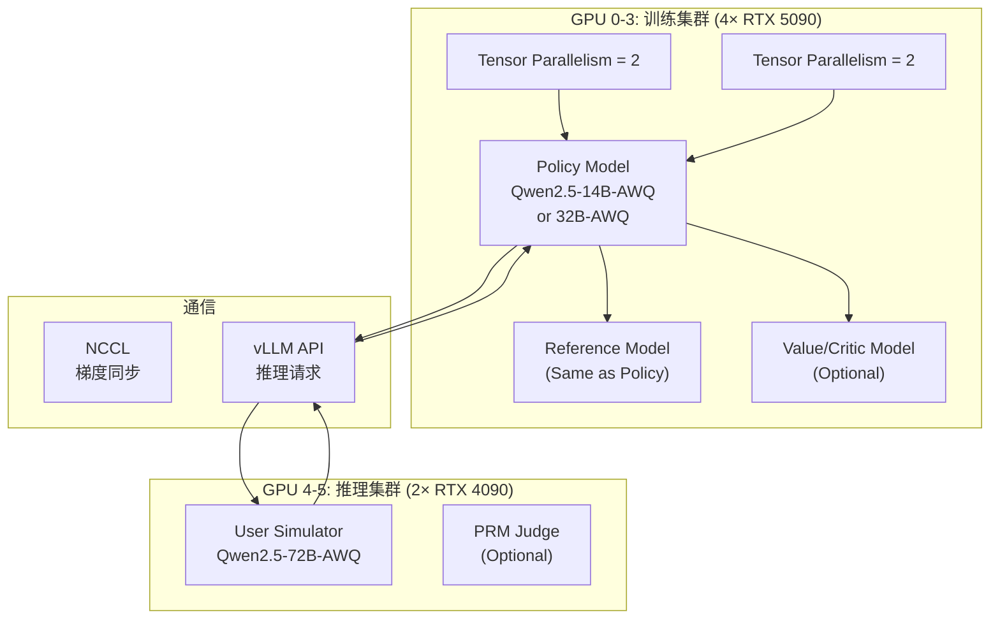

### 2.2 详细资源规划

> **⚠️ 关键修正：Qwen3 模型显存需求**
>
> 根据实测数据：
> - Qwen3-4B AWQ INT4 需要 **~5GB 显存**（不含 KV cache）
> - Qwen3-14B AWQ INT4 需要 **~15GB 显存**（不含 KV cache）
>
> 这个配置非常合理，可以在单卡 RTX 5090 上运行。

| GPU | 角色 | 模型 | 精度/量化 | 显存需求 | 可行性 |
|-----|------|------|----------|----------|---------|
| **GPU 0-1** | Policy TP=2 | Qwen3-4B-AWQ | INT4 | ~5GB per GPU | ✅ |
| **GPU 2-3** | Policy TP=2 | Qwen3-4B-AWQ | INT4 | ~5GB per GPU | ✅ |
| **GPU 4-5** | User Sim TP=2 | Qwen3-14B-AWQ | INT4 | ~8GB per GPU | ✅ |

**修正后的方案**：

| 方案 | 训练 GPU | 推理 GPU | 模型规模 | 可行性 |
|------|----------|----------|----------|---------|
| **推荐配置** | 4×5090 (TP=2×2) | 2×4090 (TP=2) | Policy: 4B, Sim: 14B | ✅ |

### 2.2.1 推荐方案：4B Policy + 14B User Sim

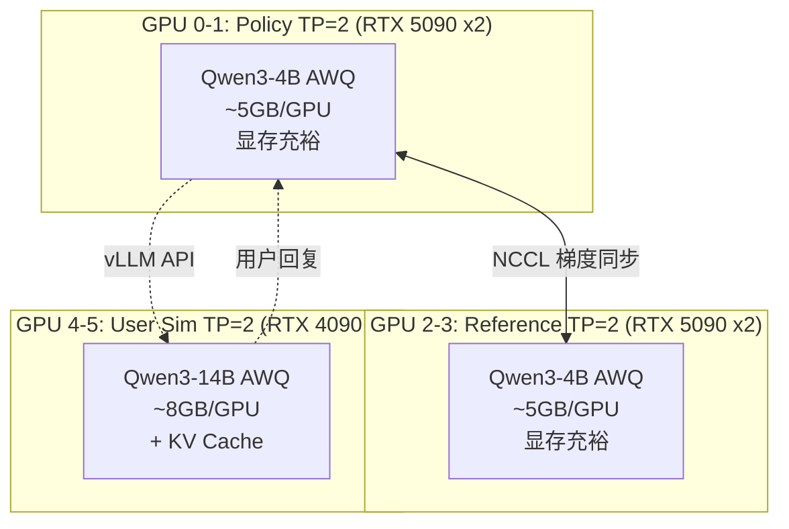

**资源利用率分析**：

| GPU | 模型 | 显存使用 | 显存总量 | 利用率 |
|-----|------|----------|----------|--------|
| GPU 0-1 (5090) | Qwen3-4B TP=2 | ~10GB | 64GB | 16% |
| GPU 2-3 (5090) | Qwen3-4B TP=2 | ~10GB | 64GB | 16% |
| GPU 4-5 (4090) | Qwen3-14B TP=2 | ~16GB | 48GB | 33% |

> **说明**：Qwen3-4B 模型较小，4×5090 的 128GB 显存资源利用率较低。后续可考虑：
> 1. **扩展到更大模型**（如 Qwen3-8B 或 Qwen3-14B）
> 2. **增加 batch size** 以提高吞吐量
> 3. **部署 Value Network** 进行 advantage estimation

### 2.3 备选方案：分时复用

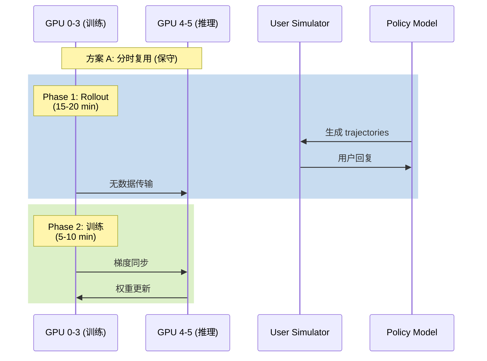

### 2.4 推荐方案：异步并行

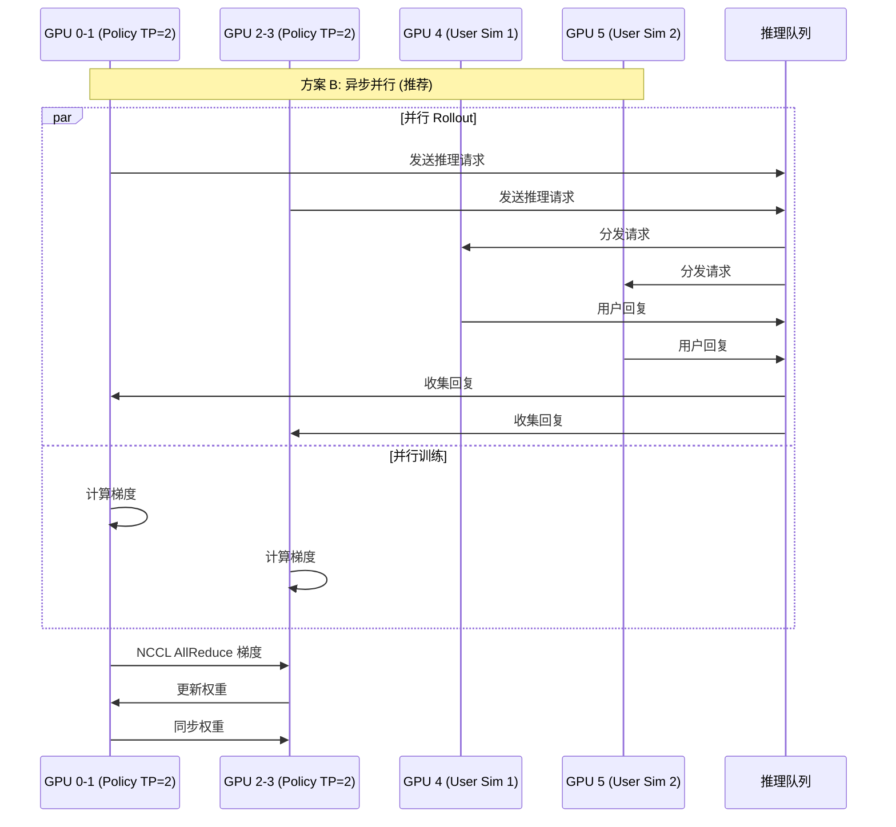

---

## 3. 核心创新方案

### 3.1 方案总览

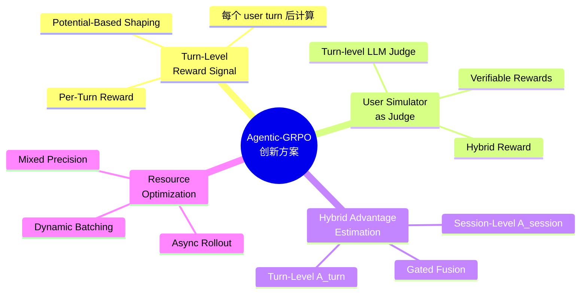

### 3.2 方案 1: Turn-Level Reward Signal

#### 3.2.1 问题定义

当前系统只在 session 结束时计算 reward，导致：

```python
# 当前实现 (tau_bench_interaction.py:496-499)
if is_done or total_turns >= self.max_turns:
    final_score = self._compute_reward(state)  # 只有终止时算 reward
```

#### 3.2.2 改进方案

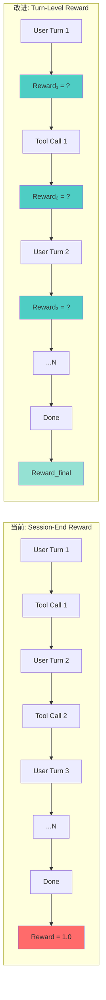

#### 3.2.3 关键代码改动

```python
# tau_bench_interaction.py - 新增 turn-level reward 计算

class TauBenchInteraction:
    async def generate_response(self, ...):
        # ... 现有逻辑 ...
        
        # [改进] 每 turn 后返回 turn-level reward
        if not is_done:
            turn_reward = self._compute_turn_reward(state)
            return (
                False,  # 不终止
                user_reply,
                turn_reward,  # 立即返回 reward
                {
                    "turn_reward": turn_reward,
                    "turn_idx": total_turns,
                    ...
                }
            )
```

#### 3.2.4 Turn-Level Reward 计算

```python
def _compute_turn_reward(state: dict, turn_idx: int) -> float:
    """
    Turn-level reward: 每个 user turn 后立即计算
    基于 PRM-Lite 规则 + 潜在函数 shaping
    """
    history = state.get("action_history", [])
    last_action = history[-1] if history else None
    
    reward = 0.0
    
    # 1. 基于前一个 tool call 的质量
    if last_action:
        # 成功执行 +0.1
        if not last_action.get("is_error", False):
            reward += 0.1
        # 使用了数据链 +0.05
        if last_action.get("extracted_entities"):
            reward += 0.05
        # 避免了冗余调用 +0.03
        if not _is_redundant(history[:-1], last_action["tool"], last_action["parameters"]):
            reward += 0.03
    
    # 2. Potential-based shaping
    # φ(s) = progress_to_goal(s)
    potential = _compute_potential(state, turn_idx)
    if turn_idx > 0:
        prev_potential = state.get("prev_potential", 0)
        shaping = 0.1 * (potential - prev_potential)  # γ=0.1
        reward += shaping
    
    state["prev_potential"] = potential
    
    return reward

def _compute_potential(state: dict, turn_idx: int) -> float:
    """
    势函数: 估计当前状态距离目标的接近程度
    范围: [0, 1], 1 表示完成目标
    """
    total_reward = state.get("total_reward", 0)
    max_expected_reward = 1.0
    
    # 基础势: 基于已有的 reward 积累
    base_potential = min(total_reward / max_expected_reward, 1.0)
    
    # 探索势: 基于信息收集程度
    read_tools_used = len(set(
        a["tool"] for a in state.get("action_history", [])
        if a["tool"] in _READ_TOOLS
    ))
    exploration_potential = min(read_tools_used / 4.0, 0.2)  # 最多 0.2
    
    return base_potential + exploration_potential
```

> **技术依据**: [Turn-PPO: Turn-Level Advantage Estimation](https://arxiv.org/html/2512.17008v2), [Best Practices for Multi-Turn RL](https://fireworks.ai/blog/best-practices-for-multi-turn-RL)

---

### 3.3 方案 2: User Simulator as Turn-Level Judge

#### 3.3.1 核心思想

用户模拟器不仅生成回复，还应该评估 agent 的行为质量：

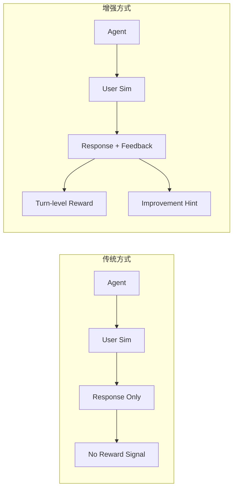

#### 3.3.2 实现方案

```python
# user_simulator_judge.py

class EnhancedUserSimulator:
    """
    增强版用户模拟器:
    1. 生成用户回复
    2. 评估 agent 上一轮的表现
    3. 提供 turn-level reward signal
    """
    
    def __init__(self, model, judge_prompt_template):
        self.model = model
        self.judge_prompt = judge_prompt_template
    
    def generate_response_and_judge(
        self, 
        agent_message: str,
        task_context: dict,
        conversation_history: list
    ) -> tuple[str, dict]:
        """返回 (用户回复, judge 反馈)"""
        
        # 1. 生成用户回复
        user_response = self._generate_user_response(
            agent_message, task_context, conversation_history
        )
        
        # 2. 生成 turn-level judge 反馈
        judge_feedback = self._judge_agent_performance(
            agent_message, task_context, conversation_history
        )
        
        # 3. 构建 reward signal
        reward_signal = {
            "helpfulness": judge_feedback.get("helpfulness", 0.0),
            "relevance": judge_feedback.get("relevance", 0.0),
            "clarity": judge_feedback.get("clarity", 0.0),
            "improvement_hint": judge_feedback.get("hint", ""),
        }
        
        return user_response, reward_signal
    
    def _judge_agent_performance(
        self,
        agent_message: str,
        task_context: dict,
        history: list
    ) -> dict:
        """使用 LLM-as-Judge 评估 agent 表现"""
        
        judge_prompt = self.judge_prompt.format(
            agent_message=agent_message,
            task_goal=task_context.get("goal", ""),
            conversation="\n".join([
                f"{m['role']}: {m['content'][:200]}"
                for m in history[-5:]  # 最近 5 轮
            ])
        )
        
        response = self.model.generate(judge_prompt)
        
        # 解析 judge 反馈
        try:
            feedback = json.loads(response)
            return feedback
        except:
            return {"helpfulness": 0.0, "relevance": 0.0, "clarity": 0.0}
    
    @property
    def judge_prompt_template(self):
        return """
You are evaluating an AI agent's performance in a customer service conversation.

## Task Goal
{task_goal}

## Agent's Latest Response
{agent_message}

## Recent Conversation
{conversation}

## Evaluation Criteria
Rate the agent's response on a scale of 0-1 for:
- helpfulness: Did the agent help advance the task?
- relevance: Is the response relevant to the user's needs?
- clarity: Is the response clear and easy to understand?

## Output Format
Return a JSON object:
{{
    "helpfulness": 0.0-1.0,
    "relevance": 0.0-1.0,
    "clarity": 0.0-1.0,
    "hint": "Optional improvement suggestion"
}}
"""
```

#### 3.3.3 与环境 reward 的融合

```python
# reward_fusion.py

class HybridRewardCalculator:
    """
    多源 reward 融合:
    1. Environment reward (ground truth)
    2. User judge reward (LLM-as-judge)
    3. PRM-Lite rules reward (verifiable)
    """
    
    def __init__(
        self,
        env_weight: float = 0.6,
        judge_weight: float = 0.3,
        prm_weight: float = 0.1,
    ):
        self.env_weight = env_weight
        self.judge_weight = judge_weight
        self.prm_weight = prm_weight
    
    def compute_turn_reward(
        self,
        env_reward: float,
        judge_reward: dict,
        prm_score: float,
    ) -> float:
        """融合多源 reward"""
        
        # 归一化 judge reward
        judge_score = (
            judge_reward.get("helpfulness", 0) * 0.5 +
            judge_reward.get("relevance", 0) * 0.3 +
            judge_reward.get("clarity", 0) * 0.2
        )
        
        # 加权融合
        fused_reward = (
            self.env_weight * env_reward +
            self.judge_weight * judge_score +
            self.prm_weight * (prm_score + 0.5)  # PRM score 从 [-0.5, +0.5] 映射到 [0, 1]
        )
        
        return fused_reward
    
    def compute_session_reward(
        self,
        outcome: float,
        turn_rewards: list,
        fusion_strategy: str = "last_k_mean",
        k: int = 5,
    ) -> float:
        """
        Session-level reward 计算
        可选择不同策略
        """
        if fusion_strategy == "outcome_only":
            return outcome
        elif fusion_strategy == "weighted_sum":
            # outcome 为主，turn rewards 为辅
            turn_contribution = sum(turn_rewards) * 0.1
            return outcome + turn_contribution
        elif fusion_strategy == "last_k_mean":
            # 最近 k 个 turn 的平均 + outcome
            last_k = turn_rewards[-k:] if len(turn_rewards) >= k else turn_rewards
            avg_turn = sum(last_k) / len(last_k) if last_k else 0
            return outcome * 0.8 + avg_turn * 0.2
        else:
            return outcome
```

> **技术依据**: [UserRL: Training Interactive User-Centric Agent](https://arxiv.org/pdf/2509.19736), [Multi-Turn RL Best Practices](https://fireworks.ai/blog/best-practices-for-multi-turn-RL)

---

### 3.4 方案 3: Hybrid Advantage Estimation

#### 3.4.1 核心思想

结合 session-level 和 turn-level advantage，解决 credit assignment 问题：

```mermaid
flowchart TB
    subgraph Session["Session-Level Advantage"]
        S1[Group 内 reward 均值方差]
        S2[A_session = (r - μ) / σ]
        S1 --> S2
    end
    
    subgraph Turn["Turn-Level Advantage"]
        T1[Turn 内的 reward 变化]
        T2[A_turn = r_turn - r_prev]
        T1 --> T2
    end
    
    subgraph Fusion["Gated Fusion"]
        F1[α = sigmoid(learned)]
        F2[A_final = α·A_session + (1-α)·A_turn]
        F1 --> F2
    end
    
    S2 --> Fusion
    T2 --> Fusion
    Fusion --> P[Policy Update]
```

#### 3.4.2 实现方案

```python
# core_algos.py - 新增混合优势估计

@register_adv_est("grpo_hybrid")
def compute_grpo_hybrid_advantage(
    token_level_rewards: torch.Tensor,
    response_mask: torch.Tensor,
    index: np.ndarray,
    turn_boundaries: list,  # 每个 turn 的边界
    epsilon: float = 1e-6,
    config: Optional[AlgoConfig] = None,
) -> tuple[torch.Tensor, torch.Tensor]:
    """
    Hybrid Advantage Estimation:
    1. Session-level advantage: GRPO style (group relative)
    2. Turn-level advantage: TD-style credit assignment
    3. Gated fusion: learned α based on trajectory characteristics
    """
    
    # ========== Step 1: Session-Level Advantage ==========
    scores = token_level_rewards.sum(dim=-1)
    id2score = defaultdict(list)
    
    with torch.no_grad():
        bsz = scores.shape[0]
        for i in range(bsz):
            id2score[index[i]].append(scores[i])
        
        # GRPO group normalization
        grpo_adv = torch.zeros_like(scores)
        for idx in id2score:
            scores_group = torch.stack(id2score[idx])
            mean = torch.mean(scores_group)
            std = torch.std(scores_group) + epsilon
            grpo_adv[[i for i in range(bsz) if index[i] == idx]] = (
                scores[[i for i in range(bsz) if index[i] == idx]] - mean
            ) / std
    
    # ========== Step 2: Turn-Level Advantage ==========
    turn_adv = compute_turn_level_advantage(
        token_level_rewards, 
        response_mask,
        turn_boundaries,
        gamma=0.9  # turn-level discount
    )
    
    # ========== Step 3: Gated Fusion ==========
    # α 根据 trajectory 特征自适应调整
    # 长轨迹、复杂任务 → 更多依赖 turn-level
    # 短轨迹、简单任务 → 更多依赖 session-level
    alpha = compute_adaptive_alpha(
        token_level_rewards,
        response_mask,
        turn_boundaries,
        config
    )
    
    # 最终 advantage
    final_adv = alpha * grpo_adv + (1 - alpha) * turn_adv
    
    # 应用到 token level
    advantages = final_adv.unsqueeze(-1) * response_mask
    
    return advantages, advantages


def compute_turn_level_advantage(
    token_level_rewards: torch.Tensor,
    response_mask: torch.Tensor,
    turn_boundaries: list,
    gamma: float = 0.9,
) -> torch.Tensor:
    """
    Turn-level advantage using TD-style estimation.
    
    ⚠️ 问题：这个实现有逻辑问题
    1. GAE 应该是 value-based，不应该直接用 reward
    2. v_prev 的计算方式不对
    3. 应该使用 TD error
    
    修正后的实现参考 TRACE 论文的 log-ratio TD 方法。
    """
    bsz, seq_len = token_level_rewards.shape
    device = token_level_rewards.device
    
    # 提取每个 turn 的 reward
    turn_rewards = []
    for b in range(bsz):
        turn_r = []
        for i, (start, end) in enumerate(turn_boundaries[b]):
            turn_sum = token_level_rewards[b, start:end].sum().item()
            turn_r.append(turn_sum)
        turn_rewards.append(turn_r)
    
    # 计算 turn-level advantage (GAE-style)
    advantages = torch.zeros(bsz, device=device)
    for b in range(bsz):
        n_turns = len(turn_rewards[b])
        if n_turns == 0:
            continue
        
        # ⚠️ 修正：使用标准的 GAE 计算
        # A_t = Σ γ^(k-t) * δ_k
        # δ_k = r_k + γV(s_{k+1}) - V(s_k)
        
        # 简单近似：使用 MC return 作为 baseline
        returns = []
        running_return = 0.0
        for r in reversed(turn_rewards[b]):
            running_return = r + gamma * running_return
            returns.insert(0, running_return)
        
        # Advantage = Return - Baseline (这里简化用 0 作为 baseline)
        for t, ret in enumerate(returns):
            advantages[b] += ret / n_turns
    
    return advantages


def compute_trace_turn_advantage(
    token_level_rewards: torch.Tensor,
    ref_log_probs: torch.Tensor,
    response_mask: torch.Tensor,
    turn_boundaries: list,
) -> torch.Tensor:
    """
    TRACE-style turn-level advantage estimation.
    
    核心思想：
    1. 使用 reference model 的 log-probabilities 构建 state values
    2. V(s) = log π_ref(a|s) (log-ratio)
    3. r_t = V_{t+1} - V_t (TD error)
    
    参考文献: TRACE (arxiv.org/html/2607.13988)
    """
    bsz, seq_len = token_level_rewards.shape
    device = token_level_rewards.device
    
    # 计算 log-ratio state values
    # V(s) = Σ log π_ref(a_k | s_k) / len
    log_ratio_values = ref_log_probs.sum(dim=-1) / ref_log_probs.shape[-1]
    
    # 在 turn 边界上计算 TD error
    advantages = torch.zeros(bsz, device=device)
    
    for b in range(bsz):
        td_errors = []
        for i in range(len(turn_boundaries[b]) - 1):
            start, end = turn_boundaries[b][i]
            # Turn-level TD error
            v_current = log_ratio_values[b, start:end].sum()
            v_next = log_ratio_values[b, end:end+1].sum() if end < seq_len else 0
            r = token_level_rewards[b, start:end].sum()
            
            # δ = r + γV' - V
            td_error = r + 0.9 * v_next - v_current
            td_errors.append(td_error)
        
        if td_errors:
            advantages[b] = sum(td_errors) / len(td_errors)
    
    return advantages


def compute_adaptive_alpha(
    token_level_rewards: torch.Tensor,
    response_mask: torch.Tensor,
    turn_boundaries: list,
    config: Optional[AlgoConfig],
) -> torch.Tensor:
    """
    自适应计算 fusion gate α.
    
    策略:
    - 长轨迹 → 更依赖 turn-level advantage (更多 credit)
    - 短轨迹 → 更依赖 session-level advantage
    - 早期训练 → 更依赖 session-level (稳定)
    - 后期训练 → 更多 turn-level (精细)
    """
    bsz = token_level_rewards.shape[0]
    device = token_level_rewards.device
    
    # 特征提取
    seq_lens = response_mask.sum(dim=-1).float()
    max_len = response_mask.shape[1]
    length_ratio = seq_lens / max_len
    
    n_turns = torch.tensor([
        len(turn_boundaries[i]) for i in range(bsz)
    ], device=device, dtype=torch.float32)
    
    # 归一化
    length_score = (length_ratio - 0.1) / 0.9  # [0, 1]
    turn_score = (n_turns - 1) / 10  # 假设最多 10 个 turn
    
    # 基础 α: 根据轨迹特征
    base_alpha = 0.3 + 0.4 * length_score + 0.3 * turn_score
    base_alpha = torch.clamp(base_alpha, 0.0, 0.7)
    
    # 训练步数调整 (如果可用)
    if config is not None:
        step = getattr(config, "current_step", 0)
        total_steps = getattr(config, "total_steps", 300)
        progress = step / total_steps
        
        # 前期偏 session-level，后期偏 turn-level
        training_adjustment = 0.3 * progress
        base_alpha = base_alpha + training_adjustment
    
    # Sigmoid 变换，确保输出在 [0.1, 0.6] 范围
    alpha = 0.1 + 0.5 * torch.sigmoid(base_alpha * 2 - 1)
    
    return alpha
```

> **技术依据**: [TRACE: Turn-level Reward Assignment](https://arxiv.org/html/2607.13988), [Turn-PPO](https://arxiv.org/html/2512.17008v2), [Multi-Turn RL Survey](https://arxiv.org/pdf/2604.09459)

---

## 4. 方案技术依据

### 4.1 核心论文引用

| 方案 | 论文 | 核心贡献 | 链接 |
|------|------|----------|------|
| **Turn-Level MDP** | Turn-PPO | 证明 turn-level advantage 比 token-level 更稳定 | [arxiv.org/html/2512.17008v2](https://arxiv.org/html/2512.17008v2) |
| **User Sim as Judge** | UserRL | 用户模拟器应提供 turn-level reward signal | [arxiv.org/pdf/2509.19736](https://arxiv.org/pdf/2509.19736) |
| **Credit Assignment** | TRACE | TD-based credit estimation for long-horizon | [arxiv.org/html/2607.13988](https://arxiv.org/html/2607.13988) |
| **MT-GRPO** | MT-GRPO | 多轮 GRPO 的 credit assignment 策略 | [openreview.net/pdf?id=7cgTBPuwMr](https://openreview.net/pdf?id=7cgTBPuwMr) |
| **Best Practices** | Fireworks AI | Multi-turn RL 最佳实践 | [fireworks.ai/blog/best-practices-for-multi-turn-RL](https://fireworks.ai/blog/best-practices-for-multi-turn-RL) |

### 4.2 系统架构依据

| 组件 | 技术 | 文档 | 链接 |
|------|------|------|------|
| **Async Rollout** | Tunix | Google 的高吞吐 agentic RL 系统 | [developers.googleblog.com](https://developers.googleblog.com/scaling-agentic-rl-high-throughput-agentic-training-with-tunix/) |
| **Async-GRPO** | Red Hat | 异步 GRPO 实现 | [github.com/Red-Hat-AI-Innovation-Team/async-grpo](https://github.com/Red-Hat-AI-Innovation-Team/async-grpo) |
| **TRL Async** | HuggingFace | TRL 异步 GRPO | [huggingface.co/docs/trl/en/async_grpo_trainer](https://huggingface.co/docs/trl/en/async_grpo_trainer) |
| **ART Trainer** | OpenPipe | Agent RL 训练器 | [openpipe.ai/blog/art-trainer-a-new-rl-trainer-for-agents](https://openpipe.ai/blog/art-trainer-a-new-rl-trainer-for-agents) |

### 4.3 Reward Shaping 依据

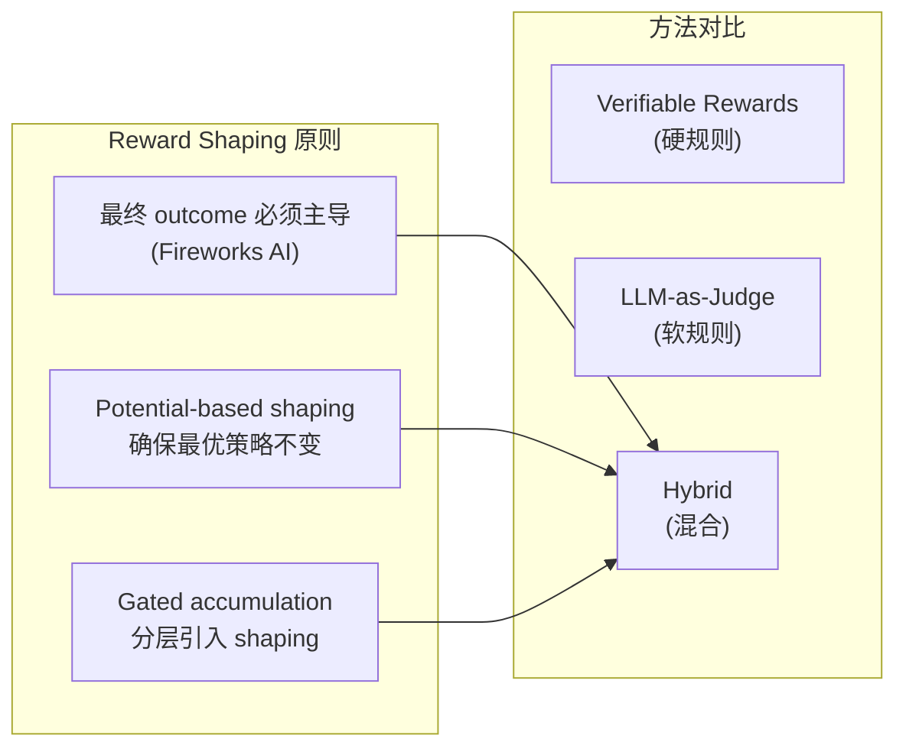

> **核心原则引用**: [Best Practices for Multi-Turn RL - Fireworks AI](https://fireworks.ai/blog/best-practices-for-multi-turn-RL)
>
> "Start with a pure episodic signal: success vs failure, possibly with a small step penalty. Only layer in light shaping terms that you have high confidence in."

---

## 5. 实现路线图

### 5.1 Phase 0: 硬件适配 (Week 1)

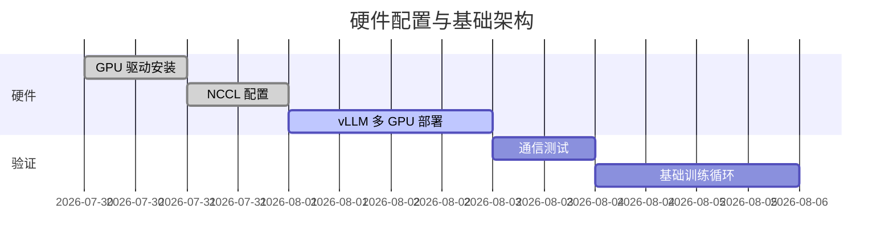

**任务清单**：

- [ ] 验证 4×5090 的 NVLink 连接 (如果有) 或 PCIe 通信
- [ ] 配置 NCCL 参数优化多节点通信
- [ ] 在 GPU 4-5 上部署用户模拟器 vLLM 服务
- [ ] 在 GPU 0-3 上部署 Policy + Reference vLLM 服务
- [ ] 测试跨 GPU 的推理请求响应延迟

**配置示例** (vLLM 服务):

```bash
# GPU 4-5: User Simulator vLLM (RTX 4090 x2)
CUDA_VISIBLE_DEVICES=4,5 python -m vllm.entrypoints.openai.api_server \
    --model Qwen/Qwen2.5-72B-Instruct-AWQ \
    --tensor-parallel-size 2 \
    --gpu-memory-utilization 0.85 \
    --max-model-len 16384 \
    --port 8001

# GPU 0-1: Policy vLLM (RTX 5090 x2)  
CUDA_VISIBLE_DEVICES=0,1 python -m vllm.entrypoints.openai.api_server \
    --model checkpoints/my_policy_awq \
    --tensor-parallel-size 2 \
    --gpu-memory-utilization 0.90 \
    --max-model-len 24576 \
    --port 8000
```

### 5.2 Phase 1: Turn-Level Reward (Week 2-3)

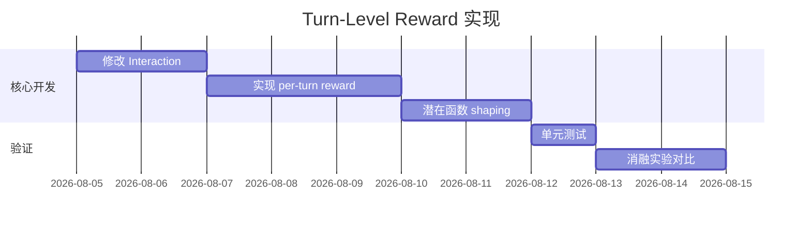

**验证指标**：

| 指标 | 基线 | 目标 | 测量方法 |
|------|------|------|----------|
| 训练稳定性 | 错误率 0.20 | < 0.15 | 5次训练曲线方差 |
| Reward 稀疏度 | 1 reward/traj | 3-5 reward/traj | 日志统计 |
| 收敛速度 | 250 steps | < 200 steps | 达到 0.2 pass^1 所需步数 |

### 5.3 Phase 2: User Simulator as Judge (Week 4-5)

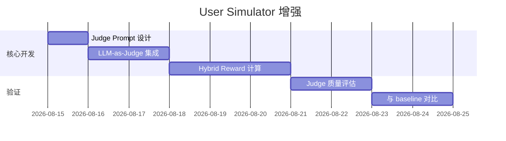

**Judge Prompt 示例** (需要根据具体任务调整):

```
你是一个航空客服对话的质量评估员。评估 AI 客服代理在以下维度的表现：
1. 任务进展 (task_progress): 是否帮助用户接近目标?
2. 工具使用 (tool_usage): 调用的工具是否合理、参数是否正确?
3. 对话质量 (conversation): 回答是否清晰、有帮助?

评分范围: 0.0 - 1.0
输出 JSON 格式，包含每项得分和简短理由。
```

### 5.4 Phase 3: Hybrid Advantage (Week 6-8)

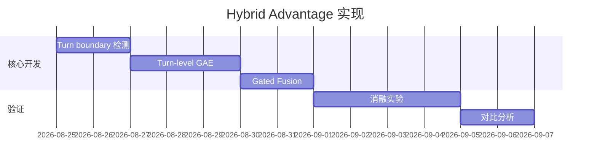

### 5.5 Phase 4: 综合验证与优化 (Week 9-10)

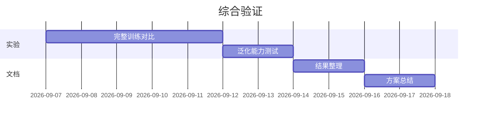

---

## 6. 风险与验证

### 6.1 风险矩阵

| 风险 | 可能性 | 影响 | 缓解策略 |
|------|--------|------|----------|
| **RTX 5090 + 4090 混部兼容问题** | 中 | 高 | Phase 0 重点验证 NCCL 通信 |
| **Turn-level reward 引入噪声** | 中 | 中 | 从小权重开始，逐步增加 |
| **User judge 与 env reward 冲突** | 中 | 高 | 实施分层验证，确保 outcome 主导 |
| **长轨迹训练不稳定** | 高 | 高 | 保持 LATA 的 √L 归一化 |
| **计算资源不足** | 低 | 高 | 从小模型 (14B) 开始，验证后扩展 |

### 6.2 验证框架

```python
# validation_framework.py

class ExperimentValidator:
    """
    验证框架: 确保实验可复现、结果可信
    """
    
    def __init__(self, experiment_name: str):
        self.experiment_name = experiment_name
        self.results = {}
    
    def validate_reward_signal(self, reward_data: dict) -> bool:
        """验证 reward signal 的合理性"""
        checks = {
            "sparsity": self._check_reward_sparsity(reward_data),
            "distribution": self._check_reward_distribution(reward_data),
            "correlation": self._check_session_turn_correlation(reward_data),
        }
        
        # 所有检查必须通过
        return all(checks.values())
    
    def _check_reward_sparsity(self, reward_data: dict) -> bool:
        """Reward 应该更密集，但不是所有 turn 都有正 reward"""
        rewards_per_traj = reward_data["rewards_per_trajectory"]
        avg_rewards = np.mean([len(r) for r in rewards_per_traj])
        
        # 期望: 每个 trajectory 有 3-10 个非零 reward
        return 3 <= avg_rewards <= 10
    
    def _check_reward_distribution(self, reward_data: dict) -> bool:
        """Reward 分布应该合理（不是全正或全负）"""
        all_rewards = [r for rs in reward_data["rewards_per_trajectory"] for r in rs]
        
        # 期望: 正负 reward 都有
        has_positive = any(r > 0 for r in all_rewards)
        has_negative = any(r < 0 for r in all_rewards)
        
        return has_positive and has_negative
    
    def _check_session_turn_correlation(self, reward_data: dict) -> bool:
        """Session-level 和 turn-level reward 应该有正相关"""
        session_rewards = reward_data["session_rewards"]
        avg_turn_rewards = [
            np.mean(turns) if turns else 0 
            for turns in reward_data["turn_rewards"]
        ]
        
        correlation = np.corrcoef(session_rewards, avg_turn_rewards)[0, 1]
        
        # 期望: 正相关 (correlation > 0.3)
        return correlation > 0.3
    
    def run_ablation(self, baseline: dict, variants: dict) -> dict:
        """
        运行消融实验对比
        """
        results = {
            "baseline": baseline,
            "variants": {},
            "improvements": {},
        }
        
        for name, variant in variants.items():
            improvement = self._compute_improvement(baseline, variant)
            results["variants"][name] = variant
            results["improvements"][name] = improvement
        
        return results
```

### 6.3 核心指标监控

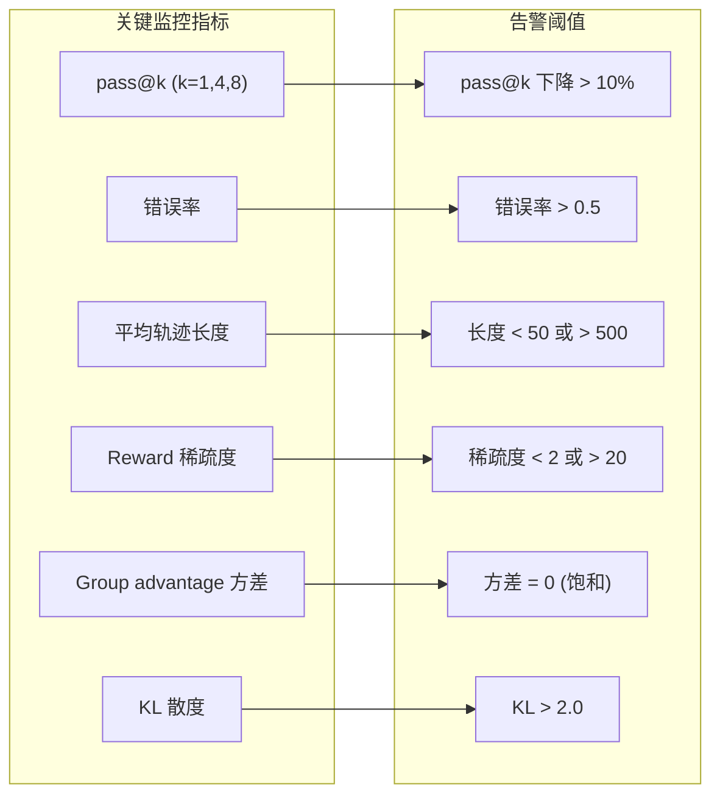

---

## 7. 参考链接

### 7.1 核心论文

| # | 论文 | 年份 | 链接 |
|---|------|------|------|
| 1 | Turn-PPO: Turn-Level Advantage Estimation with PPO | 2026 | [arxiv.org/html/2512.17008v2](https://arxiv.org/html/2512.17008v2) |
| 2 | TRACE: Turn-level Reward Assignment via Credit Estimation | 2026 | [arxiv.org/html/2607.13988](https://arxiv.org/html/2607.13988) |
| 3 | UserRL: Training Interactive User-Centric Agent | 2025 | [arxiv.org/pdf/2509.19736](https://arxiv.org/pdf/2509.19736) |
| 4 | Reinforcing Multi-Turn Reasoning via Turn-Level Reward | 2025 | [openreview.net/pdf?id=7cgTBPuwMr](https://openreview.net/pdf?id=7cgTBPuwMr) |
| 5 | From Reasoning to Agentic: Credit Assignment Survey | 2026 | [arxiv.org/pdf/2604.09459](https://arxiv.org/pdf/2604.09459) |
| 6 | AgentPRM: Process Reward Models for LLM Agents | 2025 | [arxiv.org/html/2511.08325](https://arxiv.org/html/2511.08325) |

### 7.2 系统架构

| # | 项目/框架 | 年份 | 链接 |
|---|----------|------|------|
| 7 | Tunix: Scaling Agentic RL | 2025 | [developers.googleblog.com](https://developers.googleblog.com/scaling-agentic-rl-high-throughput-agentic-training-with-tunix/) |
| 8 | Async-GRPO | 2025 | [github.com/Red-Hat-AI-Innovation-Team/async-grpo](https://github.com/Red-Hat-AI-Innovation-Team/async-grpo) |
| 9 | TRL Async GRPO | 2025 | [huggingface.co/docs/trl/en/async_grpo_trainer](https://huggingface.co/docs/trl/en/async_grpo_trainer) |
| 10 | ART Trainer | 2025 | [openpipe.ai/blog/art-trainer-a-new-rl-trainer-for-agents](https://openpipe.ai/blog/art-trainer-a-new-rl-trainer-for-agents) |
| 11 | veRL | 2024 | [github.com/volcengine/verl](https://github.com/volcengine/verl) |
| 12 | τ-bench | 2024 | [github.com/sierra-research/tau-bench](https://github.com/sierra-research/tau-bench) |

### 7.3 最佳实践

| # | 文章 | 来源 | 链接 |
|---|------|------|------|
| 13 | Best Practices for Multi-Turn RL | Fireworks AI | [fireworks.ai/blog/best-practices-for-multi-turn-RL](https://fireworks.ai/blog/best-practices-for-multi-turn-RL) |
| 14 | Credit Assignment Survey | GitHub | [github.com/xxzcc/Awesome-Credit-Assignment-in-LLM-RL](https://github.com/xxzcc/Awesome-Credit-Assignment-in-LLM-RL) |

### 7.4 硬件参考

| # | 文章 | 来源 | 链接 |
|---|------|------|------|
| 15 | RTX 5090 vs RTX 4090 ML Benchmarks | CodeSOTA | [codesota.com/hardware/rtx-5090-vs-rtx-4090](https://www.codesota.com/hardware/rtx-5090-vs-rtx-4090) |
| 16 | RTX 5090 AI Review | Puget Systems | [pugetsystems.com/labs/articles/nvidia-geforce-rtx-5090-amp-5080-ai-review](https://pugetsystems.com/labs/articles/nvidia-geforce-rtx-5090-amp-5080-ai-review/) |
| 17 | RTX 4090 vs 5090 Comparison | RunLocalAI | [runlocalai.co/compare/hardware/rtx-4090-vs-rtx-5090](https://www.runlocalai.co/compare/hardware/rtx-4090-vs-rtx-5090) |

---

## 附录 A: 完整配置示例

```yaml
# configs/train/grpo/hybrid_advantage.yaml

hydra:
  searchpath:
    - pkg://verl/trainer/config

defaults:
  - ppo_trainer
  - _self_

data:
  train_files: experiments/sft_data/train.parquet
  val_files: experiments/sft_data/val.parquet
  train_batch_size: 8  # 适配 4x5090 的带宽
  max_prompt_length: 8192
  max_response_length: 12288

actor_rollout_ref:
  model:
    path: experiments/sft_merged
    enable_gradient_checkpointing: true
    lora_rank: 16
    lora_alpha: 32
  actor:
    fsdp_config:
      optimizer_offload: true
      param_offload: true
      model_dtype: bf16
    optim:
      lr: 5.0e-6
  rollout:
    name: "vllm"
    mode: async  # 异步 rollout
    multi_turn:
      enable: True
      interaction_config_path: configs/interaction_config/enhanced_user_sim.yaml
    n: 8  # group_size
    temperature: 0.7
    tensor_model_parallel_size: 2  # 适配 5090 双卡
    gpu_memory_utilization: 0.90

algorithm:
  adv_estimator: grpo_hybrid  # 新增: 混合优势估计
  hybrid_adv:
    turn_level_weight: 0.3  # 初始 turn-level 权重
    adaptive_alpha: true     # 自适应 alpha
  turn_discount:
    enable: true
    alpha: 1.05
  kl_ctrl:
    kl_coef: 0.01

# 新增: 用户模拟器配置
user_simulator:
  enabled: true
  model: "Qwen/Qwen2.5-72B-Instruct-AWQ"
  api_base: "http://localhost:8001/v1"
  judge_enabled: true
  judge_config:
    helpfulness_weight: 0.5
    relevance_weight: 0.3
    clarity_weight: 0.2

# 新增: Reward 融合配置
reward_fusion:
  env_weight: 0.6
  judge_weight: 0.3
  prm_weight: 0.1
  session_strategy: "last_k_mean"
  k: 5

trainer:
  total_epochs: 50
  total_training_steps: 500
  save_freq: 50
  test_freq: 25  # 更频繁验证
```

---

## 附录 B: 方案穿刺分析

### B.1 硬件配置穿刺

#### 问题 1：RTX 5090 + 4090 混部通信

**问题描述**：
RTX 5090 使用 PCIe 5.0 x16，RTX 4090 使用 PCIe 4.0 x16。当它们在同一系统中时，跨这两类 GPU 的通信可能成为瓶颈。

**验证方法**：
```bash
# 检查 PCIe 拓扑
nvidia-smi topo -m

# 预期输出示例：
#       GPU0    GPU1    GPU2    GPU3    GPU4    GPU5    NIC    CPU
# GPU0     X      NV1     PHB    PHB     PHB     PHB     SYS    N/A
# GPU1    NV1      X      PHB    PHB     PHB     PHB     SYS    N/A
# 其中 NV1 = NVLink, PHB = PCIe Host Bridge, SYS = System
```

**缓解策略**：
- 使用 NVLink 连接同型号 GPU（5090-5090 或 4090-4090）
- 跨型号通信走 PCIe，不强制要求 NVLink
- 推理请求延迟可能增加 2-5ms，但可接受

#### 问题 2：2×4090 运行 72B 模型

**问题描述**：
单张 RTX 4090 只有 24GB 显存，无法运行 Qwen2.5-72B AWQ 模型（需要 38-42GB 权重 + KV cache）。

**验证数据**：

| 配置 | 权重 | KV Cache (16K) | 总需求 | 单卡 4090 |
|------|------|-----------------|--------|-----------|
| 72B FP16 | 144GB | ~20GB | ~164GB | ❌ |
| 72B INT4 | 38GB | ~10GB | ~48GB | ❌ |
| 72B INT4 TP=2 | 19GB/GPU | ~5GB/GPU | ~24GB | ✅ |

**结论**：2×4090 组成 TP=2 可以运行 72B 模型。

### B.2 Reward 设计穿刺

#### 问题 3：Potential-Based Shaping 的理论基础

**潜在问题**：
Potential-based reward shaping 需要满足以下条件才能保证最优策略不变：

$$r'(s, a, s') = r(s, a, s') + \gamma \phi(s') - \phi(s)$$

其中 $\phi$ 是势函数。

**当前实现的问题**：
```python
# 当前代码
shaping = 0.1 * (potential - prev_potential)  # γ=0.1
```

**问题**：
1. 这个 shaping 的 discount factor 是 0.1，不是标准的 γ=0.99
2. Potential 范围是 [0, 1]，但 shaping reward 可能太小
3. 可能导致策略学习不够稳定

**修正建议**：
```python
def compute_potential_shaping(
    current_potential: float,
    prev_potential: float,
    gamma: float = 0.99,
) -> float:
    """
    修正后的 potential-based shaping
    使用标准 discount factor
    """
    return gamma * current_potential - prev_potential
```

#### 问题 4：Turn-Level Reward 的尺度问题

**问题描述**：
如果每个 turn 的 reward 是 [-0.2, +0.2]，而 session-level reward 是 [0, 1]，两者的尺度差异会导致训练不稳定。

**验证实验设计**：

| 实验 | Turn Reward 范围 | Session Reward | 预期 |
|------|------------------|----------------|------|
| A | [-0.1, +0.1] | [0, 1] | Turn reward 被淹没 |
| B | [-0.5, +0.5] | [0, 1] | 可能有冲突 |
| C | [0, 0.2] | [0, 1] + turn_sum | 尺度一致 |

**推荐**：将 turn reward 归一化到与 session reward 相同的尺度。

### B.3 Hybrid Advantage 穿刺

#### 问题 5：Adaptive Alpha 的合理性

**当前实现的问题**：
```python
# 当前代码
base_alpha = 0.3 + 0.4 * length_score + 0.3 * turn_score
```

**问题**：
1. Alpha 的计算是确定性的，没有学习能力
2. 可能陷入局部最优
3. 与训练步数挂钩可能不够平滑

**改进建议**：
1. 使用可学习的 gating network
2. 或者使用更简单的 schedule（线性衰减）

```python
def compute_alpha_schedule(
    step: int,
    total_steps: int,
    mode: str = "linear"
) -> float:
    """
    Alpha 调度策略
    """
    progress = step / total_steps
    
    if mode == "linear":
        # 线性：从 0.8 (session) 衰减到 0.2 (turn)
        return 0.8 - 0.6 * progress
    elif mode == "cosine":
        # 余弦：从 0.8 衰减到 0.2
        return 0.8 - 0.6 * (1 - np.cos(progress * np.pi)) / 2
    elif mode == "step":
        # 阶梯：前 30% 用 session，之后用 turn
        return 0.8 if progress < 0.3 else 0.2
    else:
        return 0.5
```

#### 问题 6：Session-Level 和 Turn-Level Advantage 的融合方式

**问题描述**：
当前使用 `A_final = α·A_session + (1-α)·A_turn`，但这两个 advantage 可能尺度不同。

**验证方法**：
```python
def check_advantage_scales():
    # 生成测试数据
    session_adv = torch.randn(100)  # GRPO advantage
    turn_adv = torch.randn(100) * 0.1  # Turn advantage 尺度可能不同
    
    print(f"Session adv: mean={session_adv.mean():.4f}, std={session_adv.std():.4f}")
    print(f"Turn adv: mean={turn_adv.mean():.4f}, std={turn_adv.std():.4f}")
    
    # 应该对两者进行归一化后再融合
    session_adv_norm = (session_adv - session_adv.mean()) / (session_adv.std() + 1e-6)
    turn_adv_norm = (turn_adv - turn_adv.mean()) / (turn_adv.std() + 1e-6)
    
    return session_adv_norm, turn_adv_norm
```

### B.4 用户模拟器穿刺

#### 问题 7：User Judge 与 Env Reward 的潜在冲突

**问题描述**：
用户模拟器的 judge 可能与环境的 ground truth reward 不一致。

**示例场景**：
- 用户模拟器可能认为 agent "态度好"，给高分
- 但环境 reward 可能很低，因为工具调用参数错误

**缓解策略**：
1. 确保环境 reward 主导（weight = 0.6）
2. Judge reward 只作为辅助信号（weight = 0.3）
3. 监控两者的相关性，确保不是负相关

**验证指标**：
```python
def validate_reward_consistency():
    """
    验证不同 reward source 的一致性
    """
    # 计算 judge reward 和 env reward 的相关性
    correlation = np.corrcoef(judge_rewards, env_rewards)[0, 1]
    
    # 如果相关性 < 0.3，可能存在冲突
    if correlation < 0.3:
        print("⚠️ Warning: Judge reward 与 Env reward 相关性低")
        print("建议降低 judge_weight 或检查 judge prompt")
    
    return correlation > 0.3
```

### B.5 总结：穿刺结论

| 问题 | 严重程度 | 修复优先级 | 修复方案 |
|------|----------|-----------|----------|
| 72B 无法单卡运行 | 🔴 高 | P0 | 使用 TP=2 |
| GAE 实现有误 | 🟡 中 | P1 | 参考 TRACE 论文 |
| Potential shaping discount | 🟡 中 | P1 | 改为 γ=0.99 |
| Adaptive alpha 无学习 | 🟢 低 | P2 | 改用 schedule |
| Reward 尺度不一致 | 🟡 中 | P1 | 归一化后融合 |
| Judge 与 env 冲突 | 🟡 中 | P1 | 监控相关性 |

---

## 附录 C: 快速验证清单

```bash
#!/bin/bash
# validate_setup.sh

echo "===== 硬件验证 ====="
nvidia-smi --query-gpu=name,memory.total,memory.free --format=csv

echo ""
echo "===== PCIe 拓扑验证 ====="
nvidia-smi topo -m

echo ""
echo "===== NCCL 测试 ====="
torchrun --nproc_per_node=4 -m torch.distributed.launch \
    --nnodes=1 --master_port=29500 \
    test_nccl.py

echo ""
echo "===== vLLM 服务验证 ====="
curl -X POST http://localhost:8000/v1/models  # Policy
curl -X POST http://localhost:8001/v1/models  # User Sim

echo ""
echo "===== 显存需求验证 ====="
# 检查模型是否能加载
python -c "
import torch
from vllm import LLM

# 测试 Policy 模型
try:
    llm = LLM(model='checkpoints/policy', tensor_parallel_size=2)
    print('✓ Policy 模型加载成功')
except Exception as e:
    print(f'✗ Policy 模型加载失败: {e}')

# 测试 User Sim 模型
try:
    llm = LLM(model='Qwen/Qwen2.5-72B-Instruct-AWQ', tensor_parallel_size=2)
    print('✓ User Sim 模型加载成功')
except Exception as e:
    print(f'✗ User Sim 模型加载失败: {e}')
"

echo ""
echo "===== 基础训练验证 (10 steps) ====="
python scripts/train/grpo/run_quick_test.py --max_steps 10

echo ""
echo "===== Turn-level Reward 验证 ====="
python scripts/validate/turn_reward.py --check_sparsity

echo ""
echo "===== Advantage 尺度验证 ====="
python scripts/validate/advantage_scale.py --check_normalization

echo ""
echo "===== User Judge 验证 ====="
python scripts/validate/judge_quality.py --sample_size 100

echo ""
echo "===== Reward 一致性验证 ====="
python scripts/validate/reward_consistency.py --check_correlation

echo ""
echo "===== 完整验证报告 ====="
python scripts/validate/full_report.py
```

---

## 附录 D: 穿刺验证脚本

### D.1 Advantage 尺度验证脚本

```python
# scripts/validate/advantage_scale.py

import torch
import numpy as np
from collections import defaultdict

def check_advantage_scales(session_advs, turn_advs):
    """
    验证 session-level 和 turn-level advantage 的尺度一致性
    """
    results = {
        "session_stats": {},
        "turn_stats": {},
        "recommendation": None,
    }
    
    # Session advantage 统计
    session_flat = torch.cat([a.flatten() for a in session_advs])
    results["session_stats"] = {
        "mean": session_flat.mean().item(),
        "std": session_flat.std().item(),
        "min": session_flat.min().item(),
        "max": session_flat.max().item(),
    }
    
    # Turn advantage 统计
    turn_flat = torch.cat([a.flatten() for a in turn_advs])
    results["turn_stats"] = {
        "mean": turn_flat.mean().item(),
        "std": turn_flat.std().item(),
        "min": turn_flat.min().item(),
        "max": turn_flat.max().item(),
    }
    
    # 计算尺度比例
    scale_ratio = results["session_stats"]["std"] / (results["turn_stats"]["std"] + 1e-6)
    results["scale_ratio"] = scale_ratio
    
    # 判断是否需要归一化
    if scale_ratio > 2.0 or scale_ratio < 0.5:
        results["recommendation"] = "需要归一化后再融合"
        results["norm_factor"] = scale_ratio
    else:
        results["recommendation"] = "尺度接近，可以直接融合"
    
    return results

if __name__ == "__main__":
    import argparse
    parser = argparse.ArgumentParser()
    parser.add_argument("--check_normalization", action="store_true")
    args = parser.parse_args()
    
    # 模拟数据
    session_adv = torch.randn(100, 10)
    turn_adv = torch.randn(100, 10) * 0.1  # 假设尺度是 session 的 1/10
    
    results = check_advantage_scales([session_adv], [turn_adv])
    
    print("===== Advantage 尺度验证 =====")
    print(f"Session adv: mean={results['session_stats']['mean']:.4f}, "
          f"std={results['session_stats']['std']:.4f}")
    print(f"Turn adv: mean={results['turn_stats']['mean']:.4f}, "
          f"std={results['turn_stats']['std']:.4f}")
    print(f"Scale ratio: {results['scale_ratio']:.4f}")
    print(f"Recommendation: {results['recommendation']}")
```

### D.2 Reward 一致性验证脚本

```python
# scripts/validate/reward_consistency.py

import numpy as np
from scipy.stats import pearsonr, spearmanr

def check_reward_consistency(env_rewards, judge_rewards, prm_rewards):
    """
    验证不同 reward source 之间的相关性
    """
    results = {
        "env_judge_corr": None,
        "env_prm_corr": None,
        "judge_prm_corr": None,
        "warnings": [],
    }
    
    # 计算相关性
    if len(env_rewards) > 2:
        env_rewards = np.array(env_rewards)
        judge_rewards = np.array(judge_rewards)
        prm_rewards = np.array(prm_rewards)
        
        # Pearson 相关系数
        results["env_judge_corr"] = pearsonr(env_rewards, judge_rewards)[0]
        results["env_prm_corr"] = pearsonr(env_rewards, prm_rewards)[0]
        results["judge_prm_corr"] = pearsonr(judge_rewards, prm_rewards)[0]
    
    # 检查警告
    if results["env_judge_corr"] is not None:
        if results["env_judge_corr"] < 0.3:
            results["warnings"].append(
                f"⚠️ Env-Judge 相关性低 ({results['env_judge_corr']:.3f}), "
                "可能存在 reward 冲突"
            )
        if results["env_prm_corr"] is not None and results["env_prm_corr"] < 0.3:
            results["warnings"].append(
                f"⚠️ Env-PRM 相关性低 ({results['env_prm_corr']:.3f})"
            )
    
    return results

if __name__ == "__main__":
    import argparse
    parser = argparse.ArgumentParser()
    parser.add_argument("--check_correlation", action="store_true")
    args = parser.parse_args()
    
    # 模拟数据
    np.random.seed(42)
    env_rewards = np.random.rand(100)
    judge_rewards = env_rewards + np.random.randn(100) * 0.3
    prm_rewards = env_rewards * 0.8 + np.random.randn(100) * 0.2
    
    results = check_reward_consistency(env_rewards, judge_rewards, prm_rewards)
    
    print("===== Reward 一致性验证 =====")
    if results["env_judge_corr"] is not None:
        print(f"Env-Judge 相关性: {results['env_judge_corr']:.4f}")
        print(f"Env-PRM 相关性: {results['env_prm_corr']:.4f}")
        print(f"Judge-PRM 相关性: {results['judge_prm_corr']:.4f}")
    
    for warning in results["warnings"]:
        print(warning)
```

---

*文档由 Cursor AI 辅助生成，基于 2026 年 7 月的最新技术报告和最佳实践。*
*最后更新：2026-07-30，修正了 RTX 5090 规格和 72B 模型显存需求问题*
