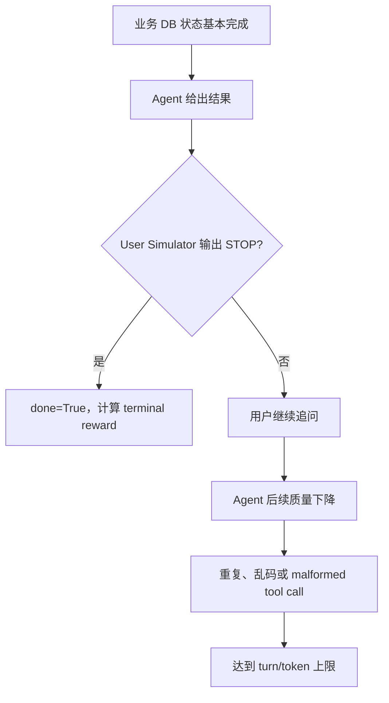
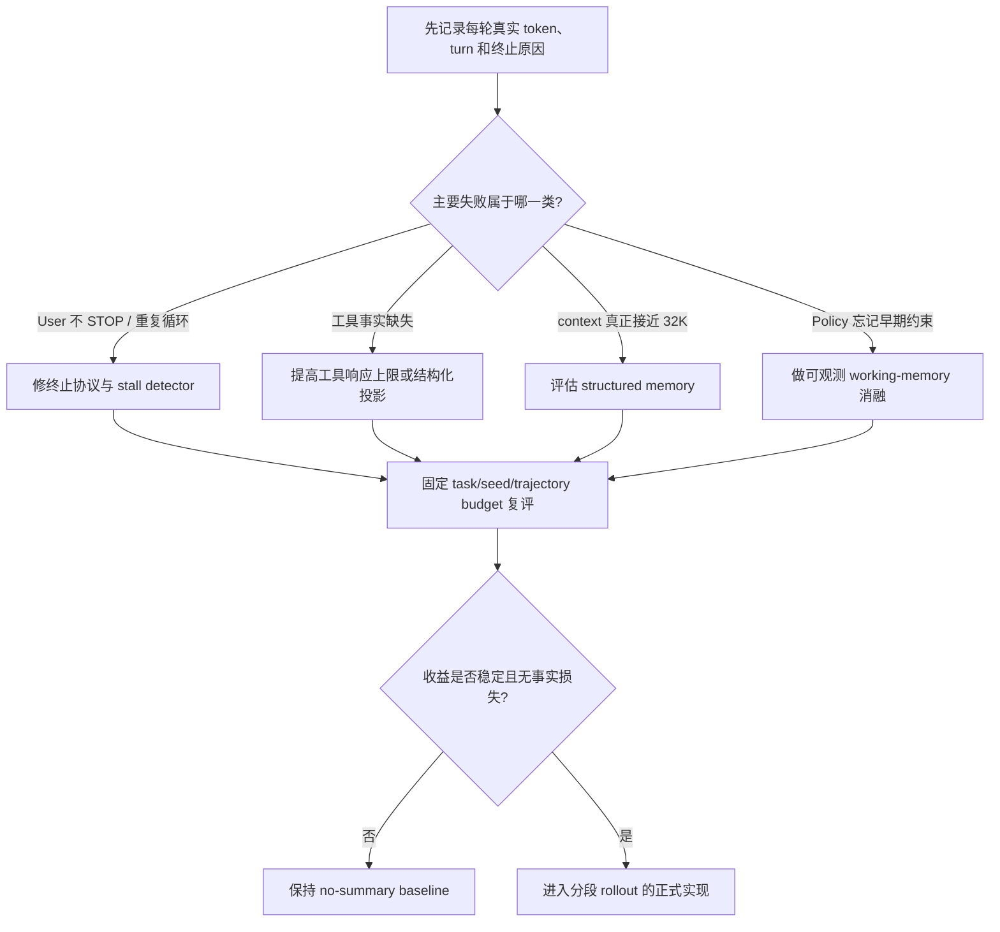

# 面试题：为什么当前 Agentic RL 项目暂不做对话历史 Summary？

> 适用场景：大模型算法、Agentic RL、智能体开发、上下文工程和强化学习系统面试。
>
> 项目范围：τ-bench airline、多轮工具调用、Qwen3-8B Policy、Qwen3-14B User Simulator，
> 以及 Vanilla GRPO、Turn-PPO、TRACE-style Hybrid Advantage、User Simulator Judge 四组实验。
>
> 当前结论：**暂不实现通用的中途历史 Summary；先解决终止、工具信息和可观测性问题。**

---

## 1. 先给面试官结论

### 30 秒版本

> 我的判断是，当前阶段不做通用 History Summary 是一个有意的工程取舍，
> 不是遗漏。我们对现有 τ-bench airline 成功轨迹做了统计：去掉工具阶段完成后的
> 重复对话后，业务核心流程的中位数约 10 个 assistant turn，P90 约 15 个 turn，
> 而当前 H200 配置提供 32K context，绝大多数样本没有真实的上下文容量问题。
> 现在的长尾主要来自 User Simulator 没有及时输出 `###STOP###`、工具结束后重复追问，
> 以及模型后半段格式退化。Summary 只能部分缓解注意力问题，解决不了终止协议；
> 同时当前工具返回只保留 256 字符，这比 History Summary 更可能造成关键信息缺失。
> 所以我的优先级是先补 context/termination 日志，修 STOP 和 stall，再优化工具结果；
> 只有当 P95 context 超过 22K–24K token，或者超过 10% 的失败明确由历史遗忘导致时，
> 才启动结构化 memory，而不是自由文本 Summary。

### 一句话版本

> **当前瓶颈是“终止和信息质量”，不是“上下文容量”；先做 Summary 会优化错对象，
> 还可能破坏 PPO 的条件上下文一致性。**

---

## 2. 90 秒标准回答

> 我的判断是，是否做 Summary 不能只看“这是多轮对话”，而要看三个证据：
> 任务到底需要多少轮、上下文是否真的触顶，以及失败是不是由历史遗忘造成。
>
> 第一，当前数据集一共有 50 个 airline task，40 个 seen、10 个 unseen。
> 现有 80 条非空成功轨迹只覆盖 19 个 task，所以我把它当长度估计，而不把它当因果实验。
> 原始轨迹的 assistant turn 中位数是 10，P75 是 15，P90 是 19；但进一步检查发现，
> 16.25% 的轨迹在最后一次工具调用后又继续了至少 5 轮，最极端样本继续了 20 轮，
> 内容已经出现重复追问、乱码和残缺工具调用。去掉这部分 post-tool loop 后，
> 核心流程 P90 回到 15 turn，约 94% 的成功轨迹可在 15 turn 内完成。
>
> 第二，H200 配置是 12,288 prompt、16,384 response、32,768 model context，
> 总预算 28,672 token，没有直接触顶。历史内容字符数的 P90 约 19K，绝大多数仍有余量。
> 反而工具响应默认只保留 256 字符，reservation JSON 中间的航班、价格和状态字段可能丢失，
> 这会迫使 Agent 重复读取工具，是更直接的信息瓶颈。
>
> 第三，当前 veRL 把整个 episode 表示成一条连续 causal sequence。如果第 10 轮删掉旧历史，
> 用 Summary 继续生成，前 10 轮 action 和后续 action 实际来自不同条件上下文；
> 直接用一条最终 `input_ids` 重算 PPO log-prob，会产生上下文不一致。
> Turn-PPO 的 value、TRACE 的 prefix score 和 turn span 也都需要重新对齐。
> 因此正确实现不是 AgentLoop 加一次 LLM 调用，而是分段保存每轮 `(context, action)`。
>
> 所以当前我先不做通用 Summary，而是先修终止协议、重复循环、工具返回和监控。
> 如果监控证明 P95 context 达到 22K–24K，或者长任务失败中有 10% 以上属于早期事实遗忘，
> 我会实现只基于可观测信息的结构化 memory，并保证 train/eval 使用同一压缩策略。

---

## 3. 项目背景与当前约束

### 3.1 数据与业务

当前数据是 τ-bench airline 多轮客服任务，常见业务包括：

- 查询用户和 reservation；
- 取消航班；
- 修改航班和舱位；
- 处理 basic economy 等业务约束；
- 多 reservation 联合操作；
- 计算费用并向用户确认；
- 在 write tool 前完成必要的读取和确认。

数据切分见：

- [`split.json`](../../agentic-grpo-longhorizon/experiments/sft_collect_airline/split.json)

当前切分：

| 数据 | Task 数 |
|---|---:|
| Seen / train | 40 |
| Unseen / holdout | 10 |
| 总计 | 50 |

### 3.2 四种训练方式

| 方法 | 核心信用分配 | Summary 引入后的额外影响 |
|---|---|---|
| Vanilla GRPO | terminal outcome 组相对优势 | Policy log-prob 必须对应真实 summary 后上下文 |
| Turn-PPO | turn reward + critic/GAE | 每个 turn 的 value state 必须和压缩后的 observation 对齐 |
| TRACE Hybrid | frozen reference prefix score + TD credit | Summary 会改变 prefix state，reference score 必须重算 |
| User Judge | outcome GRPO + 可选 judge signal | Judge、Policy 和 User Simulator 有三套不同 history 语义 |

Summary 不是一个与算法无关的纯 UI 功能，它会改变强化学习中的 observation/state。

---

## 4. 数据证据：真正需要多少轮？

### 4.1 统计口径

当前可分析的非空 SFT 轨迹：

- 80 条；
- 覆盖 19 个 task；
- 全部标记为 success；
- 没有失败对照样本。

因此下面的数字可以支持“成功任务通常多长”，但不能直接证明 Summary 会提升或降低成功率。
面试时要主动说明这个证据边界，避免把描述统计讲成因果结论。

### 4.2 原始成功轨迹长度

| 指标 | Assistant turns | Tool calls | 全部消息内容字符数 |
|---|---:|---:|---:|
| 最小 | 3 | 1 | 1,553 |
| P25 | 6 | 4 | 4,683 |
| 中位数 | 10 | 7 | 10,380 |
| P75 | 15 | 10 | 13,646 |
| P90 | 19 | 12 | 19,477 |
| 最大 | 26 | 14 | 30,948 |
| 平均 | 11.33 | 7.16 | 10,563 |

表面看 P90 达到 19 turn，似乎应该做 Summary；但只看总长度会误判根因。

### 4.3 长尾里有多少是真实业务复杂度？

进一步计算最后一次工具调用之后的 assistant turn 数：

- 80 条中，62 条在 15 turn 内结束，占 77.5%；
- 18 条超过 15 turn，占 22.5%；
- 13 条在最后一次工具调用后又继续至少 5 个 assistant turn，占 16.25%；
- 最极端样本在最后一次工具调用后继续了 20 个 assistant turn。

如果按“最后一次工具调用后最多保留一个正常最终回答”近似去除 post-tool loop：

| 指标 | 估计业务核心 assistant turns |
|---|---:|
| P25 | 6 |
| 中位数 | 10 |
| P75 | 13 |
| P90 | 15 |
| 最大 | 19 |
| 平均 | 9.54 |

去除明显循环后，约 93.75% 的成功轨迹可在 15 个 assistant turn 内完成；
真正可能需要超过 15 turn 的样本约占 6.25%，而且其中仍可能包含低效规划。

### 4.4 具体坏例

[`task_0034.jsonl`](../../agentic-grpo-longhorizon/experiments/sft_collect_airline/task_0034.jsonl)
中有一条 26-turn 的成功轨迹：

- 前半段完成两个 reservation 的读取、升级和取消；
- 后续用户询问其他 upcoming flights 和总价；
- 工具阶段结束后，用户重复询问精确金额；
- Agent 开始输出乱码、残缺 JSON、无效 `<tool_call>`；
- 最后一次工具调用后仍继续 20 个 assistant turn。

这条轨迹说明：

1. 长度并不等于业务难度；
2. 模型可能已经进入 degeneration loop；
3. User Simulator 没有可靠地结束对话；
4. Summary 可能短暂改善注意力，但不会修复 STOP 协议或输出格式崩坏。

### 4.5 合理的任务轮数预估

| 任务类型 | 合理 assistant turns | 典型链路 |
|---|---:|---|
| 简单查询或单 reservation 操作 | 3–6 | 查询 → 单次操作 → 回答 |
| 中等取消、修改、改签 | 6–10 | 确认 → 多次 read → write → 反馈 |
| 多 reservation、多约束 | 10–15 | 多对象状态收集 → 条件判断 → 多次 write → 汇总 |
| 超过 15 turn | 少数复杂任务或异常循环 | 需要单独做坏例归因 |

因此当前 `max_assistant_turns=15` 是合理首发值，不应仅根据最长样本直接提高到 25–30。

---

## 5. 为什么当前 context 不是第一瓶颈？

### 5.1 H200 的实际预算

H200 启动器提供：

```text
max_prompt_length   = 12,288
max_response_length = 16,384
max_model_len       = 32,768
```

因此：

```text
12,288 + 16,384 = 28,672 < 32,768
```

仍保留约 4,096 token 的模型上下文余量。对应实现：

- [`h200_4gpu_common.sh`](../../agentic-grpo-longhorizon/scripts/train/grpo/h200_4gpu_common.sh)

当前 AgentLoop 还会在累计 response 区达到上限时提前终止，避免无限追加：

- [`tool_agent_loop.py`](../../verl/verl/experimental/agent_loop/tool_agent_loop.py)

### 5.2 现有轨迹通常没有触及 32K

80 条成功轨迹的内容字符 P90 约 19.5K。英文、JSON 和自然语言不是一字符一 token，
即使考虑工具 schema 和 chat template，大多数样本仍低于 32K。

严谨说法不是“绝对不会超长”，而是：

> 当前没有证据证明 context overflow 是主要失败源；必须先记录真实 tokenizer token 数和终止原因。

### 5.3 更直接的问题是工具结果只有 256 字符

veRL 默认配置：

```yaml
max_tool_response_length: 256
tool_response_truncate_side: middle
```

来源：

- [`rollout.yaml`](../../verl/verl/trainer/config/rollout/rollout.yaml)

这段配置按字符截断工具响应，而不是按 token。SFT 轨迹中的 reservation JSON 常见
700–1000 字符，RL rollout 只保留首尾各约 128 字符，可能丢失：

- 中间航段；
- cabin 和 fare 条件；
- 价格与 payment；
- reservation 状态；
- 多乘客信息；
- write tool 的完整确认结果。

这会导致 Agent 重复 read、记错实体或错误 write。当前有 32K context，却先把关键工具事实
截断到 256 字符，然后再考虑总结对话，这个优化顺序不合理。

---

## 6. 长尾的第一根因：终止协议，而不是 Summary

τ-bench 的普通 response 路径只有在 User Simulator 输出：

```text
###STOP###
```

时才把环境置为 `done=True` 并计算 terminal reward：

- [`tau-bench/envs/base.py`](../../tau-bench/tau_bench/envs/base.py)

因此可能出现：



这类轨迹中，Summary 解决的是 F 的一部分，却没有解决 C。正确优先级应当是：

1. 记录为什么没有 STOP；
2. 检测业务状态是否已有进展；
3. 检测重复 user message；
4. 检测 post-tool 无状态变化；
5. 对 policy stall 做可训练失败终止；
6. 最后才判断是否需要 Summary。

注意：不能仅凭 verifier 暂时为 1 就强制终止，因为用户可能还需要最终解释或确认。
更稳妥的是把 verifier-ready 作为诊断信号，引导 User Simulator 再做一次 satisfaction/STOP 判断。

---

## 7. 为什么朴素 Summary 会破坏 PPO 语义？

### 7.1 当前 rollout 是一条连续序列

当前数据形态近似：

```text
prompt
  + assistant_1
  + tool_1
  + user_1
  + assistant_2
  + ...
```

Policy token 的损失使用 `response_mask=1`，tool/user observation 使用 `response_mask=0`。
Actor 更新时会在这条连续 causal sequence 上重算 new-policy log-probability。

### 7.2 中途替换历史后，一条序列无法表达两种条件上下文

假设第 10 轮执行压缩：

```text
原上下文 h_10  →  action a_10
summary s(h_10) + recent  →  action a_11
```

真实采样概率为：

```text
π_old(a_10 | h_10)
π_old(a_11 | s(h_10), recent)
```

如果训练时把 episode 重新拼成一条完整历史：

```text
π_new(a_11 | h_10, summary, recent)
```

它和 rollout 时的条件上下文不同，PPO ratio 不再比较同一状态下的新旧策略。

如果最终只保留 summary：

- 早期 action token 被删除，无法训练；
- turn span 发生偏移；
- value 和 advantage 对齐改变。

如果保留原历史再追加 summary：

- 条件上下文可以保持一致；
- 但没有节省 context；
- summary 只是额外的 salience hint。

### 7.3 从 POMDP 角度看

History Summary 相当于定义了新的 observation function：

```text
z_t = S(h_t)
```

只有当 `z_t` 对后续最优决策近似充分时，才不会造成严重 state aliasing。Airline 任务对精确
reservation ID、日期、金额、舱位、确认状态非常敏感；两个不同历史如果被压成同一个自然语言
摘要，最优动作可能完全不同。

例如：

```text
历史 A：用户已经确认支付升级费用
历史 B：Agent 只告知费用，用户尚未确认
```

如果 Summary 都写成“用户希望升级舱位”，模型可能在历史 B 中未经确认直接调用 write tool。

### 7.4 对四种算法的具体影响

#### Vanilla GRPO

- terminal outcome 仍可计算；
- 但 Policy update 必须使用 action 真实采样时的 summary 后 context；
- 否则 PPO new/old log-prob 条件不一致。

#### Turn-PPO

- critic 估计的是 `V(s_t)`；
- summary 使 `s_t` 改变；
- 每个 turn 的 value、reward 和 action span 都需要基于压缩后 state 保存。

#### TRACE Hybrid

- frozen reference 对每个 state prefix 的同一 gold target 打分；
- summary 改变 state prefix；
- 不能继续使用原始完整历史的 prefix score；
- summary 必须进入 frozen-reference scoring contract。

#### User Simulator Judge

- Policy history、User Simulator 内部 history、Judge recent history 是三套不同状态；
- 只压缩 Policy 不会压缩 User Simulator；
- 如果使用 User Simulator 的 hidden instruction 生成共享 Summary，会泄露 privileged goal；
- 因此三套 history 必须独立设计，不能共用一段摘要。

---

## 8. 为什么不使用简单 Sliding Window？

面试官可能会问：“既然 Summary 难，保留最近几轮不就行了吗？”

我的回答是：

> Sliding Window 适合闲聊，但不适合直接用于精确工具业务。Airline 的关键约束经常在第一轮出现，
> write tool 可能在第 10 轮才执行。如果窗口删掉原始用户要求、reservation ID 或确认状态，
> 模型会在最危险的写操作阶段丢失依据。

以下字段不能依赖最近窗口偶然保留：

- 原始用户目标；
- reservation、user、flight、payment ID；
- 日期、金额和 cabin；
- 已确认与待确认状态；
- 成功 write confirmation；
- 失败 tool error；
- 仍未完成的 pending action。

如果必须压缩，应该做结构化 state，而不是盲目删前 N 轮。

---

## 9. 当前更合理的优化顺序



### 优先级 1：可观测性

至少记录：

```text
context_tokens_per_turn
assistant_tokens_per_turn
tool_observation_tokens
tool_response_original_chars
tool_response_kept_chars
tool_response_truncated
assistant_turns
user_turns
tool_calls
last_tool_to_end_gap
repeated_user_message_count
malformed_tool_call_count
termination_reason
```

终止原因必须拆分：

```text
environment_done
terminate_tool
max_assistant_turns
max_user_turns
interaction_max_turns
response_token_budget
model_context_limit
policy_stall
infrastructure_failure
```

### 优先级 2：STOP 与 Stall

可以先做诊断或规则消融：

- 最近三次 user message 高相似；
- 最后一次 tool call 后连续四轮没有新状态变化；
- 连续两轮 malformed tool call；
- 连续两轮明显格式崩坏；
- 业务 verifier 已 ready，但 User Simulator 仍不 STOP。

如果判断为 policy stall，应作为 trainable failure，而不是 infrastructure failure。

### 优先级 3：工具信息质量

优先比较：

1. `max_tool_response_length=256` baseline；
2. 提升到 1024；
3. 提升到 2048；
4. reservation/tool-specific 结构化字段投影。

结构化投影通常比 LLM Summary 更可验证、更便宜，也更不容易修改金额和 ID。

### 优先级 4：只有证据充分时才做 Memory

先做 working memory，不直接做自由文本 Summary。

---

## 10. 如果未来要做，合理方案是什么？

### 10.1 结构化可观测 Memory

示例：

```yaml
observable_goal:
  - cancel XEHM4B
  - cancel 59XX6W

constraints:
  - if basic_economy, upgrade before cancellation

entities:
  XEHM4B:
    observed_cabin: economy
    previous_observed_cabin: basic_economy
    upgrade_confirmed_by_tool: true
    cancellation_confirmed_by_tool: true

  59XX6W:
    observed_cabin: economy
    cancellation_confirmed_by_tool: true

completed_actions:
  - update_reservation XEHM4B
  - cancel_reservation XEHM4B
  - cancel_reservation 59XX6W

pending_actions: []
last_tool_error: null
user_confirmation_state: confirmed
```

必须满足：

- 只使用 Policy 已经观察到的信息；
- 不读取 hidden task goal；
- 不读取未通过工具展示的环境 DB 状态；
- ID、日期、金额和 write confirmation 尽量原样保存；
- Memory builder 尽量确定性；
- 无法确定时宁可保留 raw event，不做猜测；
- train 与 eval 使用完全相同的 memory 规则。

### 10.2 保留最近原始事件

建议保留：

- 原始用户请求；
- 结构化 memory；
- 最近 3–4 个 interaction cycle；
- 所有 unresolved error；
- 所有 pending write confirmation。

### 10.3 RL-correct 的分段 rollout

真正压缩 context 时，不再只存一条最终序列，而是存：

```text
(context_0, action_0, observation_1)
(context_1, action_1, observation_2)
...
(summarized_context_t, action_t, observation_t+1)
```

训练端按 segment 重算 log-prob，Turn-PPO/TRACE 的 state value 和 turn credit 也按 segment 对齐。
这是比“直接替换 prompt_ids”更正确的实现。

---

## 11. 什么时候我会改变“不做 Summary”的判断？

当前不是永远不做，而是设置明确的触发门槛。

满足任一条件，就进入 structured-memory 设计：

| 触发指标 | 建议门槛 |
|---|---:|
| P95 policy generation context | 超过 22K–24K token |
| 因 context/response budget 终止的 rollout | 超过 10% |
| 长任务失败中明确属于早期事实遗忘 | 超过 10% |
| 需要超过 15 turn 的真实业务核心流程 | 稳定超过 10% |
| Tool response 完整后仍大量重复 read | 说明不只是截断问题 |
| 数据扩展到 retail/跨领域/20+ turn | 重新评估 |

如果只是最长样本达到 26 turn，但其中 20 turn 是退化循环，不构成 Summary 的充分理由。

---

## 12. 实现难度与预期收益

下面是当前数据上的初步工程估计，不是已经跑出的实验结果。

| 方案 | 实现成本 | 上下文节省 | 当前全局效果预估 | 主要风险 |
|---|---:|---:|---:|---|
| 仅截断旧 `messages` | 1–2 天 | 不确定 | -3～0 个百分点 | Policy prompt_ids 未真正压缩、事实丢失 |
| LLM 自由文本 Summary | 2–4 天 | 部分 | -3～+2 个百分点 | ID/金额/确认状态幻觉 |
| Summary 作为额外 hint，不删历史 | 2–4 天 | 否 | 0～+2 个百分点 | 增加 token 和调用延迟 |
| 确定性结构化 Memory | 3–6 天 | 部分 | 0～+3 个百分点 | schema 不完整、状态别名 |
| 分段 rollout + RL-correct compaction | 1–2 周 | 是 | 当前可能 0～+3 个百分点 | 改动 PPO/Turn/TRACE 数据合同 |

在真正的 12+ turn 长任务子集上，结构化 Memory 可能带来更高收益，例如 +3～+8 个百分点；
但当前长任务占比小，折算到全局后收益很可能只有 0～2 个百分点。

这些范围必须通过实验验证，面试中不能把它讲成已取得的线上指标。

---

## 13. 如何设计一个可信的 Summary 消融？

### 13.1 保持公平

所有实验固定：

- 相同 seen/unseen split；
- 相同 task IDs；
- 相同采样 seed；
- 相同 policy checkpoint；
- 相同 rollout trajectory budget；
- 相同最大 turn；
- 相同 User Simulator；
- 相同 tool schema 和工具返回策略。

不能一边加 Summary，一边增加 context、turn 或训练 steps，否则无法归因。

### 13.2 方案组

| 组别 | 方案 |
|---|---|
| A | No Summary baseline |
| B | Tool response 1024，不做 Summary |
| C | Structured tool projection，不做 Summary |
| D | Structured Memory + 最近 4 个 cycle |
| E | LLM Summary + factual consistency gate |

### 13.3 指标

业务指标：

- terminal success；
- pass@k；
- pass^k；
- unseen task success；
- write-tool error rate。

行为指标：

- 平均 assistant turns；
- 平均 tool calls；
- repeated read rate；
- post-tool loop rate；
- malformed tool call rate；
- `###STOP###` 正常结束率。

上下文指标：

- context token P50/P90/P95/P99；
- tool observation token 占比；
- context-budget termination rate；
- Summary 触发率。

Summary 质量指标：

- ID exact match；
- date/amount exact match；
- completed/pending action recall；
- false confirmation rate；
- hidden-goal leakage rate。

### 13.4 决策规则

只有当 structured memory 同时满足：

1. unseen success 提升；
2. factual error 不增加；
3. write-tool error 不增加；
4. rollout token/延迟确实下降；
5. 三个以上 seed 或 task-level bootstrap 区间稳定；

才值得进入正式训练主线。

---

## 14. 面试官常见追问

### 追问 1：多轮 Agent 不做 Summary，不会忘记前面的信息吗？

> 会有遗忘风险，但风险是否值得引入 Summary，要由失败数据证明。当前去除 post-tool loop 后，
> 核心流程 P90 约 15 turn，H200 又有 32K context；同时工具结果被截断到 256 字符，
> 所以我优先解决显式信息损失，再判断是否存在注意力遗忘。否则 Summary 可能把本来可见的
> 精确 ID 和金额压成不可靠自然语言，反而让 write action 更危险。

### 追问 2：为什么不直接把 context 开到更大？

> 更大 context 可以降低溢出，但不能修复 User Simulator 不 STOP、模型循环、工具信息被截断和
> PPO state 对齐问题。当前已经是 32K，统计也没有证明容量是主瓶颈。先扩大 context 只会增加
> KV cache、延迟和 rollout 成本，可能掩盖真正坏例。

### 追问 3：为什么不用另一个模型做 Summary？

> 独立模型能避免占用 Policy 生成，但会引入新的非平稳 observation source。它可能修改金额、
> ID 或确认状态，还会增加每条长 trajectory 的调用成本。更关键的是，无论谁生成 Summary，
> PPO 都必须按 action 实际看到的 Summary 后 context 训练，所以核心难点不是调用哪个模型，
> 而是 rollout/training 数据合同。

### 追问 4：Summary 会不会泄露标签？

> 会。如果 Summary builder 读取 hidden task goal、verifier target 或未通过工具展示的 DB 状态，
> 就相当于把 privileged evaluator information 注入 Policy。尤其 TRACE 使用训练 gold target 给
> frozen scorer 打分，但 gold target 不能出现在 actor prompt。Memory 只能使用可观测对话和工具结果。

### 追问 5：为什么 15 turn 是合理的？

> 不是拍脑袋。原始成功轨迹中 77.5% 在 15 turn 内；检查最后工具之后的循环并做近似去噪后，
> 业务核心 turn 的 P90 是 15，约 94% 在 15 turn 内。超过 15 的少量 case 应先做坏例分类，
> 不能直接把退化循环当作业务复杂度。

### 追问 6：如果线上用户真的需要 30 轮怎么办？

> 线上 30 轮和当前 benchmark 是不同分布。我会引入结构化 session state、checkpoint、分段 rollout、
> 最近窗口和可恢复 memory，并重新训练/eval。当前结论只针对 τ-bench airline、当前 50-task 数据和
> 32K context，不把它过度外推到所有长对话业务。

### 追问 7：不做 Summary，你做了什么替代工作？

> 我没有停在“暂时不做”。替代方案是先建立 context/termination 可观测性，拆分 STOP、turn limit、
> token limit 和 policy stall；然后提高或结构化工具响应，加入 post-tool loop 检测；最后根据
> context P95 和事实遗忘率决定是否进入 structured memory。这个路径更容易归因，也更符合当前坏例。

### 追问 8：这对 TRACE 有什么特殊影响？

> TRACE 的 dense credit 来自 frozen reference 对每个 state prefix 的 gold-target log-prob。
> Summary 之后 state prefix 发生变化，reference scorer 必须看到和 Policy 完全相同的压缩状态；
> 否则计算出的 TD delta 不再对应真实动作状态。所以 TRACE 不是不能做 Summary，而是必须把
> Summary 正式纳入 state transition 和 prefix-scoring contract。

---

## 15. 项目讲述模板：为什么做 → 怎么做 → 结果

### 为什么做

> 我们发现这是长时序多轮 Agentic RL，直觉上容易想到 History Summary。但我没有直接加功能，
> 因为 Summary 会改变 observation，可能影响 PPO 和 turn-level credit。我先确认当前数据是否真的
> 存在 context overflow，以及长轨迹是不是业务刚需。

### 怎么做

> 我从数据和代码两侧穿刺。数据侧统计 80 条成功轨迹的 turn、tool calls、内容长度和最后工具之后
> 的对话间隔；代码侧检查 H200 context、AgentLoop token 累积、工具响应截断、τ-bench STOP 语义，
> 以及 GRPO、Turn-PPO、TRACE、User Judge 的训练状态合同。最终发现核心流程 P90 约 15 turn，
> 但存在明显 post-tool loop；同时 tool response 只有 256 字符，终止和信息质量比 context 更紧迫。

### 当前结果

> 当前结果不是“Summary 提升了多少”，因为还没有启动这项实验；结果是形成了一个有数据门槛的
> 技术决策：第一阶段保持 no-summary baseline，先补终止和 context 指标，修 STOP/stall 和工具信息；
> 当 P95 context 超过 22K–24K，或历史遗忘占长任务失败超过 10% 时，再做 structured memory。
> 这样避免同时改变环境状态和 RL 算法，保证后续实验可归因。

这个讲法的重点是：**不虚构指标，同时体现算法理解、工程判断、坏例分析和实验设计能力。**

---

## 16. 最终决策

### 当前阶段

```text
不做通用 History Summary
```

### 先做

```text
context/termination 日志
    → User Simulator STOP 与重复循环
    → tool response 截断与结构化
    → policy stall detector
    → 固定预算复评
```

### 满足门槛后再做

```text
observable structured memory
    → 最近 3–4 个 raw cycles
    → factual consistency gate
    → segmented rollout
    → Turn-PPO/TRACE state 对齐
```

### 面试收尾句

> 我不是认为 Summary 没价值，而是当前证据表明它不是第一瓶颈。Agentic RL 项目里，
> 一个常见误区是看到长对话就堆 memory、summary 和更大 context，但没有先确认失败到底来自
> 容量、遗忘、工具信息还是终止协议。我的取舍是先把根因和评估闭环做清楚，再增加会改变
> state distribution 的复杂模块。对当前 τ-bench airline，这是更稳、更可解释、也更容易做公平消融的方案。

---

## 17. 证据入口

- 数据切分：[`split.json`](../../agentic-grpo-longhorizon/experiments/sft_collect_airline/split.json)
- 典型长尾：[`task_0034.jsonl`](../../agentic-grpo-longhorizon/experiments/sft_collect_airline/task_0034.jsonl)
- Vanilla 配置：[`vanilla_grpo.yaml`](../../agentic-grpo-longhorizon/configs/train/grpo/vanilla_grpo.yaml)
- H200 上下文覆盖：[`h200_4gpu_common.sh`](../../agentic-grpo-longhorizon/scripts/train/grpo/h200_4gpu_common.sh)
- Agent 历史累积：[`tool_agent_loop.py`](../../verl/verl/experimental/agent_loop/tool_agent_loop.py)
- AgentLoop 单序列输出：[`agent_loop.py`](../../verl/verl/experimental/agent_loop/agent_loop.py)
- Tool response 截断默认值：[`rollout.yaml`](../../verl/verl/trainer/config/rollout/rollout.yaml)
- τ-bench STOP/reward：[`base.py`](../../tau-bench/tau_bench/envs/base.py)
