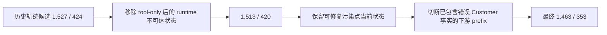

# DeepSeek V4 Flash User Simulator 全量生成与 SFT 导出审计

> 状态：Teacher 原始生成、两轮语义/事实接地审计、SFT 导出与离线 runtime 合同检查已经完成；Qwen3-14B LoRA、Student-prefix rollout、在线 A/B 和主 Policy RL 尚未运行。本文记录 2026-08-04 的实际结果，不把静态数据通过写成微调后效果保证。

## 1. 两套数量必须分开理解

本项目保留原始生成证据，同时只把二次审计后的样本送入训练：

| 口径 | 数量 | 含义 |
|---|---:|---|
| DeepSeek v1.5 原始 full batch | 1,513 | runtime 可调用位置上的一次性 Teacher 生成结果，保持不可变 |
| 二次审计后的自然训练源 | 1,463 | 排除 50 个已被错误历史 Customer 事实污染的下游 prefix |
| benchmark holdout | 353 | 10 个 unseen task 的 audit-only 状态，不发给 Teacher、不进 SFT |
| rich / TRL train | 1,635 | trial00–06；只在 train 对 STOP 做 3 倍物化采样 |
| rich / TRL eval | 164 | trial07 自然分布，不重采样 |

最终产物：

- `outputs/user_simulator_data/full/v1.2.jsonl`：1,513 条 DeepSeek v1.5 原始结果；
- `outputs/user_simulator_data/full/v1.2_audited_v2.jsonl`：1,463 条最终训练源；
- `outputs/user_simulator_data/full/v1.2_audited_v2.report.json`：上下文切断、事实接地修复、语义修改、provenance 与 SHA256；
- `outputs/user_simulator_data/sft/train.jsonl`、`eval.jsonl`：项目训练器使用的 rich 数据；
- `outputs/user_simulator_data/sft/train_trl.jsonl`、`eval_trl.jsonl`：每行严格只有 `{"messages": [...]}` 的 TRL conversational JSONL；
- `outputs/user_simulator_data/sft/manifest.json`：源文件、prompt 版本、对齐检查、行数与导出哈希；
- `outputs/user_simulator_data/sft/alignment_audit.json`：独立离线 runtime/data 合同审计。

这些数据位于 gitignored `outputs/`，不会把大体量样本或密钥提交到 Git；代码、合同和审计报告进入版本控制。

## 2. Case 构造为什么从 1,527 变为 1,513，再变为 1,463

### 2.1 runtime 不可达：1,527 → 1,513

历史轨迹有 14 个 seen 状态和 4 个 holdout 状态发生在 tool-only turn 之后。role flip 后，prefix 已以 `assistant`（模拟 Customer）结尾；若再追加 Customer target，会形成连续两个 `assistant` turn。

当前 `TauBenchInteraction` 只在 Agent 产生自然语言 `RESPOND` 时调用 User Simulator，tool call 后不会立即调用，所以这些状态在真实 runtime 不可达，必须过滤。第一阶段得到 1,513 seen / 420 holdout。

### 2.2 错误历史会污染后续状态：1,513 → 1,463

第二轮审计新增 typed observable-grounding gate 后，发现历史 Customer prefix 中存在 15 个 seen 轨迹污染根，例如：

- 把未出现的 `*4523` 说成已知 payment ID；
- 虚构航班/预订号 `HAT4567`；
- 虚构出生年份 1995；
- 补出 instruction/history 从未提供的 LAX、Chicago、Dallas 等 route/city；
- 把 cheapest direct flight 错称为 second-cheapest。

当前污染轮本身仍是可修复的训练状态，因为输入 prefix 尚未包含该错误，Teacher target 可重新给出接地回复；但它之后的状态已经把错误 Customer 回复写入历史。继续保留下游状态会产生错误的 teacher-forced world state，因此从每个污染根后切断，排除 50 个 seen 下游状态。holdout 从 2 个污染根后切断 67 个下游状态，最终为 353。



最终 1,463 条 seen prefix 全部以 `user` role 结束，表示“最新一条 Agent 可见文本”，其后才追加 Student 的最后一个 `assistant` target。

## 3. Teacher 配置与信息权限

原始 full batch 使用：

```json
{
  "model": "deepseek-v4-flash",
  "thinking": false,
  "temperature": 0.3,
  "top_p": 0.9,
  "max_tokens": 1600,
  "prompt_version": "tau-airline-usim-teacher-v1.5"
}
```

v1.5 的关键是改变信息架构：Teacher 请求只包含 `scenario + observable conversation`。gold actions、tool results、trajectory reward 和 hidden identifiers 不进入模型请求，只留在本地 deterministic QA。

这修复了 v1.4 的根因：尽管 Prompt 明令禁止使用 privileged reference，只要 Teacher 实际看到该 block，仍会泄漏 58 个 case 中的隐藏 reservation/payment entity。信息权限必须通过输入结构实现，不能只靠“看见但别用”的自然语言要求。

原始 v1.5 生成阶段的数据与调用统计仍作为历史证据保留：

| 指标 | 原始结果 |
|---|---:|
| natural cases | 1,513 |
| 自动门禁 accepted | 1,513 / 1,513 |
| privileged entity leak | 0 |
| response 长度 | min 10 / median 110 / p95 243 / max 319 chars |
| generation attempts | 1,655 |
| retried cases | 56 |
| 最大单 case attempts | 8 |
| canonical final-row prompt tokens | 3,011,234 |
| canonical final-row completion tokens | 282,631 |
| canonical final-row total tokens | 3,293,865 |
| all-attempt prompt tokens（可重建） | 3,362,525 |
| all-attempt total tokens（保守下界） | 3,645,156 |

canonical JSONL 丢弃了旧 retry row，所以 3,293,865 不是完整账单。prompt usage 可由 `generation_attempt` 重建，旧 retry completion/cache usage 不可恢复，因此 3,645,156 只能称为下界。若未来需要精确费用，应保存 append-only attempt ledger 或使用 provider billing export。

当前 Prompt 已升级为 v1.6，额外明确“Agent 示例中的 ID 不是事实”和“缺失 reservation ID/DOB 时不得补全”；但为了保证 provenance，已有原始 v1.5 数据不会被伪装成 v1.6 重新生成。最终导出 manifest 同时记录 `source prompt=v1.5` 与 `current prompt=v1.6`。

## 4. 第二轮穿刺发现：0 privileged leak 不等于 0 幻觉

第一轮 gate 主要检查“Teacher 是否复制本地 privileged block”。它无法发现 Teacher 自己新造一个从任何输入都不存在的实体。第二轮 typed grounding audit 在最终可审计的 raw population 中识别出 69 个受影响 target、86 个 issue occurrence：

| 问题类型 | occurrence | 例子 |
|---|---:|---|
| unsupported reservation ID | 24 | 虚构 `OMAR1234`、`A1B2C3`、`RES12345` |
| Agent 示例被复制为真实 reservation | 11 | 把示例 `ABC123`、`ZFA04Y` 当作用户已有预订 |
| placeholder identifier | 21 | `...`、`[ID]`、`[date]`，包括 ID 与省略号之间插有描述的情况 |
| user ID 被误称 reservation ID | 7 | 把 `ivan_rossi_8555` 或 `8555` 当预订号 |
| unsupported airport / city | 14 | instruction 只写 JFK 或 Texas，却补出 LAX、Chicago、Dallas |
| unsupported DOB year | 3 | 输入没有 DOB，却回复具体年份 |
| unsupported flight code | 2 | 凭空创造航班号 |
| unsupported payment ID | 1 | 凭空给出卡尾号 |
| 其他 typed grounding | 3 | 历史预订提及、模板占位符、unsupported user ID |

这说明事实接地必须按实体类型判断，而不是简单做“输出 token 是否在输入出现过”：同一个字符串以不同类型出现也可能是错误，Agent 为解释格式给出的 example ID 也不能被 Customer 当成事实。

二次审计处理策略：

| action | 数量 | 含义 |
|---|---:|---|
| `repair_observable_grounding` | 22 | 用逐条审阅且通过新 gate 的历史 Customer reference 替换虚构 target |
| `repair_same_decision_semantics` | 57 | 决策方向未变，但修复路线、ID 类型、占位符、金额阈值、second-cheapest、DOB 等内容错误 |
| `canonicalize_stop` | 40 | 已完成目标却继续追问/致谢，改为精确 STOP |
| `restore_continue` | 4 | 仍有 gift card、姓名、舱位或取消目标未完成 |
| `rewrite_continue` | 2 | CONTINUE 正确，但问题问错或自相矛盾 |
| `retain_deepseek` | 24 | 人工复核确认 Teacher 正确修正历史 premature STOP |

最终 target provenance 为：DeepSeek v1.5 原样 1,338 条、human semantic audit 103 条、reviewed historical reference 22 条。每条修订样本都保留 audit version、action 和 provenance，不把人工修改伪装成模型原始输出。

## 5. 决策与终止语义

原始数据有 70 个 historical/Teacher next-turn decision disagreement：historical STOP → Teacher CONTINUE 52 个，historical CONTINUE → Teacher STOP 18 个。历史标签和 Teacher 都不是天然 gold，因此逐条读取 scenario、observable history 和候选回复后再判断，而不是强制对齐。

最终 1,463 条自然分布：

| Decision | 数量 |
|---|---:|
| CONTINUE | 1,270 |
| STOP | 193 |

STOP 进一步分为 175 个 `goal_satisfied`、8 个 `cannot_continue`、10 个 `goal_failed`。`###STOP###` 是 episode terminal action，不等于 task success；无法继续或 fallback 全部失败也应正确终止，但元数据不能伪装为成功。

### Case A：task 4 gift-card 目标尚未完成

Scenario 同时要求 cabin、baggage、passenger 与 payment。Agent 只确认前面三项并问是否还需要帮助，用户明确要求 gift card payment。正确 target 是：

```text
Yes, I'd like to use my gift card for the payment.
```

若在此 STOP，Simulator 会把“部分数据库动作完成”误学成“全部用户目标完成”。

### Case B：task 9 已告知 Mastercard 总额

Agent 已明确给出：

```text
Total amount charged to your Mastercard: $2,033
```

此时再次追问总额只会制造 delayed termination，正确 target 是精确 `###STOP###`。如果相邻状态中的 Agent 没有写 `$2,033`，则仍应 CONTINUE；不能按 task ID 粗暴统一标签。

### Case C：Agent 示例 ID 不是用户事实

Agent 可能说“reservation ID looks like `ABC123`”。Teacher 若回复“my reservation is ABC123”，虽然未触碰 privileged block，却创造了一个错误世界状态。v1.6 Prompt 与 typed gate 都要求改为询问如何查找 ID，或诚实说明当前没有该信息。

### Case D：同为 CONTINUE，也可能语义完全错误

task 11 的 fallback 要求证书金额超过 $100 时改用其他方式。错误 target 把 `$125 > $100` 解释成低于阈值；task 25 则把“second-cheapest”写成最便宜航班。它们的 decision 都是 CONTINUE，decision-match 指标看不见这些错误，因此必须审计 response semantics。

## 6. 训练数据与真实 runtime 的结构对齐

独立脚本直接从当前 `tau_bench/envs/user.py` 的 AST 提取 `LLMUserSimulationEnv.build_system_prompt()`，逐条核对最终自然源：

1. 1,463/1,463 runtime system prompt 字符串精确一致；
2. 1,463/1,463 `messages[:-1]` 与 source case 的 role-flipped runtime prefix 精确一致；
3. `user` 永远是 Agent-visible text，`assistant` 永远是模拟 Customer；
4. target 始终是最后一个 `assistant` turn，且只是一句自然回复或精确 `###STOP###`；
5. 无 `tool` role、无活跃 prefix STOP、角色严格交替；
6. `loss_mask_mode=last_assistant`，历史 Customer turn 只提供状态，不计算 loss；
7. Qwen3 chat template 和 vLLM runtime 均关闭 thinking；
8. 353 个 holdout case 有 0 个进入 Teacher/SFT。

Qwen3 loss mask 不能简单使用 `add_generation_prompt=True` 的 prefix 长度，因为关闭 thinking 时仍可能渲染空 think block。当前实现对“完整最后 assistant render”和“最后 assistant content 置空 render”取 token-level common prefix，只监督真实 target 与 assistant end-of-turn suffix；短 STOP target 也不再被最小 label-token 门槛误删。

离线长度审计采用非常保守的上界：所有 UTF-8 content bytes 加每条 message 64 token 再加 256 safety margin，最大为 13,548，低于当前 `max_length=16,384`。这证明配置不会在该上界下截断样本，但不代替真实 tokenizer 训练日志中的 truncation 统计。

## 7. Train / eval / TRL 导出合同

trial07 的 164 个最终自然状态进入 eval，其余 trial 进入 train，case ID 交集为 0。只在 train 对 terminal boundary 做 3 倍物化采样：

| 文件 | 行数 | CONTINUE | STOP | 分布 |
|---|---:|---:|---:|---|
| natural source | 1,463 | 1,270 | 193 | 原始 |
| rich / TRL train | 1,635 | 1,131 | 504 | train STOP ×3 |
| rich / TRL eval | 164 | 139 | 25 | 自然分布 |

TRL 共 1,799 行，每行只含顶层 `messages`；rich 文件额外保留 task/case ID、termination metadata、replica 和 provenance。eval 是 seen-task state-level model-selection split，同一 task instruction 仍可能出现在 train；它不是业务泛化结论。353 个 unseen holdout 状态只能在微调后通过在线 rollout 评估，不能用 Teacher label 偷偷进入 SFT eval。

## 8. Teacher forcing 的剩余风险

一条训练样本的 role、prompt 和当前 target 可以完全正确，但多轮 Student rollout 仍可能偏离历史轨迹。当前是 one-step teacher forcing：后续 prefix 来自历史 Customer，而不是由前一条新 Teacher/Student target 重新 rollout 得到。

离线统计中，1,148 个能链接到下一历史状态的 case 里，只有 46 个 Teacher target 能逐字重建下一状态中的历史 Customer prefix；自然 target 与历史 reference 精确相等的也只有 179 个。这不说明其余 target 错误，而说明训练和部署的状态分布不同：

\[
\mathcal{D}_{\text{SFT}}(h_t) \neq d^{\pi_{\text{agent}},\,U_\phi}(h_t).
\]

因此当前能证明的是“单步监督与 runtime 合同对齐”，不能证明“微调后多轮信息记忆和终止稳定”。下一阶段必须做：

- Student-prefix free rollout：让 Qwen3 自己生成前一轮 Customer，再检查下一轮是否保持约束、身份、偏好和已披露信息；
- frozen Agent policy A/B：同一 Agent、任务和 seed 下替换 Simulator，比较 reward、长度和失败类型；
- cross-simulator evaluation：用强 Teacher/不同 Simulator/必要时真人复核，防止 Policy 只适配一个环境模型；
- trajectory-level consistency：跟踪重复索要、事实漂移、提前/延迟 STOP，而不仅看单轮 decision accuracy。

## 9. 最终离线验证结果

本轮没有运行模型训练、API 生成或 benchmark rollout；只执行本地数据重建、审计脚本和 25 个标准库单测（22 个 data/contract + 3 个 loss-mask）。独立对齐报告为：

```json
{
  "status": "passed",
  "scope": "offline runtime/data contract; online rollout quality is not proven",
  "natural_rows": 1463,
  "runtime_prompt_exact": 1463,
  "source_prefix_exact": 1463,
  "observable_grounding_issues": 0,
  "privileged_entity_leaks": 0,
  "holdout_in_sft": 0,
  "context_excluded_rows": 50,
  "train_rows": 1635,
  "eval_rows": 164,
  "conservative_max_tokens": 13548,
  "configured_max_length": 16384
}
```

关键 SHA256：

| Artifact | SHA256 |
|---|---|
| final audited natural source | `7b69d546a353bd805554e3044bcd252594284529aef501c0b01d714b7b938323` |
| rich train | `5e5077273e01fcc5a1c7eefe86e0eaebed109bfe20dd666ffd849a758106c372` |
| rich eval | `5020fddcab01b2cefa846cc0aadbc1ba520037be161f43b5cb2bd298daec971e` |
| TRL train | `becb64757589fd6890b03ac01ef870a7016d22edf3252c88d900ae0a900df24d` |
| TRL eval | `89be5d093484591ad804878d7e00b4575d4fcb1ed70a237893601d6fb3e86492` |

当前可下的结论是：最终 SFT 数据在离线层面与真实 User Simulator prompt、role contract、STOP 格式、可观测事实和 loss mask 对齐，可进入 LoRA smoke test。当前不可下的结论是“微调后多轮一致性、STOP latency 或主 Agent reward 已提升”；这些结论必须由 student-prefix rollout、online A/B 与主 Policy RL 给出。
