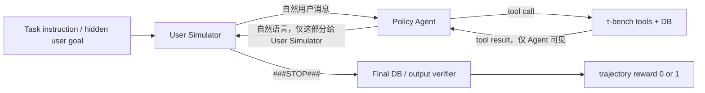
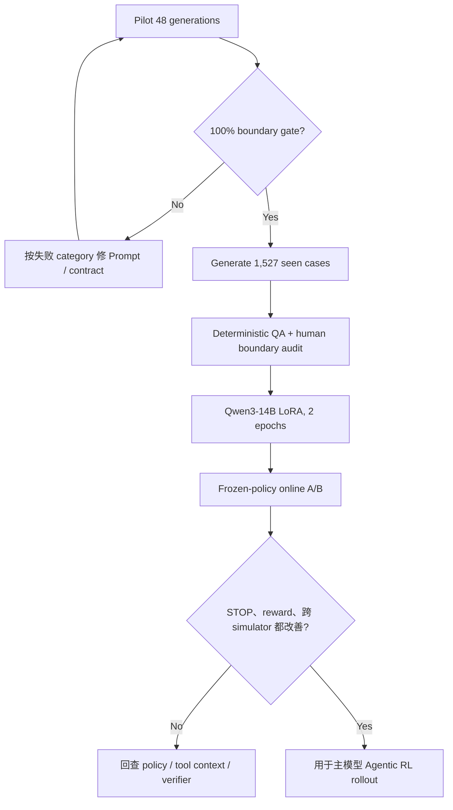

# τ-bench Airline User Simulator：高质量微调数据方案与实现

> 目标：提升 User Simulator 的任务遵循、渐进披露和终止校准，减少无效长尾，同时不把 Agent 的工具/推理错误伪装成“用户应该早点结束”。生成的数据最终用于微调当前 `/data/xjz/model/qwen3-14b` User Simulator，并作为主模型 Agentic RL 的交互环境。

## 1. 先给结论：两个现象相关，但不是同一个根因

“User Simulator 迟迟不输出 `###STOP###`”与“工具任务完成后 Agent/User 继续循环”有交集，但不能全部归因于 User Simulator。

| 现象 | 应归因的条件 | 当前项目中的典型表现 | 正确处理 |
|---|---|---|---|
| 任务已完成且 Agent 已完整告知，User 仍继续 | User Simulator 的终止判断或训练数据有问题 | 已报告所有订票/取消结果后仍追问 | 增加成功边界 STOP 样本，优化终止召回率 |
| 数据库动作已完成，但 Agent 漏报用户要求的结果 | Agent communication / credit assignment 问题 | 完成改签却没说总节省金额 | User 应继续，不能用 STOP 掩盖 Agent 错误 |
| Agent 回复损坏、重复或没有明确答案 | Policy 生成、上下文或 tool observation 问题 | task 34 连续输出损坏的 `total_cost` | User 继续澄清是合理行为；修 Agent/tool context |
| instruction 有要求，但 verifier 未检查 | Task/evaluator 合同问题 | task 34 要求其他航班总价，但 `outputs=[]` | 修任务标签或加 communication verifier |
| 任务确已完成，User 迟停直到 max turns | User Simulator 问题 | 多轮礼貌回复或重复请求 | 训练 exact STOP，并记录 STOP latency |

因此，本方案不会把所有“长对话”都合成为 STOP。目标是学习正确的决策边界：

\[
\text{STOP} \iff
\text{all user goals resolved}
\land
\text{all required results communicated}
\land
\text{no active fallback/subgoal}
\]

而不是：

\[
\text{STOP} \Leftarrow \text{某个写工具成功}
\]

## 2. 当前环境的真实终止与奖励语义

当前 [`LLMUserSimulationEnv`](../../tau-bench/tau_bench/envs/user.py) 的输入只有：

1. 完整 task instruction；
2. Agent 发给用户的自然语言；
3. User Simulator 自己此前的回复。

Agent 的 tool call 和 tool result 不会进入 User Simulator 的内部 history。Simulator 是一个现实用户视角，而不是数据库观察者。

环境在 [`Env.step()`](../../tau-bench/tau_bench/envs/base.py) 中用以下逻辑结束正常对话：

```python
observation = self.user.step(action.kwargs["content"])
done = "###STOP###" in observation

if done:
    reward_res = self.calculate_reward()
```

这有三个直接后果：

- 不输出 STOP，正常 outcome reward 就不会在该回合结算；
- 过早 STOP 会截断仍可完成的任务，通常得到 0；
- STOP 是终止决策，不等价于 success。失败、无法继续或用户放弃也可能结束，但必须单独标注原因。



## 3. 数据审计结果

### 3.1 当前主模型 SFT 轨迹不能直接训练 User Simulator

当前 `experiments/sft_collect_airline` 有 80 条被筛选的成功 policy 轨迹，只覆盖 19/50 个任务。更关键的是：

- 80/80 均未保存 terminal user response；
- 57 条文件以 assistant 结尾；
- 23 条文件以 tool 结尾；
- `###STOP###` 在这些训练 messages 中出现 0 次。

原因在 [`TauBenchWrapper.run_single_task()`](../../agentic-grpo-longhorizon/src/envs/tau_bench_wrapper.py)：当 `user_obs.done=True` 时只累计 reward，不把 terminal observation 追加到 `messages`。这些轨迹适合主 Agent SFT，却没有 User Simulator 的 STOP label。

### 3.2 最适配的公开数据已经在仓库内

[`sonnet-35-new-airline.json`](../../tau-bench/historical_trajectories/sonnet-35-new-airline.json) 是 τ-bench 官方公开历史轨迹，MIT License，与当前 50 个 airline tasks、工具、数据库和终止 token 同域：

- 50 tasks × 8 trials = 400 trajectories；
- reward=1：184 条；reward=0：216 条；
- 含 STOP：263 条；不含 STOP：137 条；
- STOP 与 reward 的交叉分布：

| | STOP | 无 STOP |
|---|---:|---:|
| reward=1 | 92 | 92 |
| reward=0 | 171 | 45 |

这张表再次证明：不能把“历史 STOP”自动翻译为“goal satisfied”，也不能把“reward=1”自动翻译为“最后一轮应该 STOP”。历史回复只作为覆盖与参考，新的 teacher 必须重新判断。

按当前 [`split.json`](../../agentic-grpo-longhorizon/experiments/sft_collect_airline/split.json) 去重后，本管线得到：

- 16 条人工 curated pilot：12 CONTINUE + 4 STOP；
- 1,527 条 seen-task teacher generation cases；
- 424 条 unseen benchmark holdout audit cases，代码强制禁止发给 teacher 或进入微调。

### 3.3 为什么第一版不混入通用 TOD 数据

MultiWOZ、Schema-Guided Dialogue 等数据可以增加语言风格，但其 slot/state、工具可见性、任务完成和终止定义与当前 τ-bench 不一致。第一版最重要的是校准 STOP 边界，而不是扩大闲聊多样性，因此：

- 主数据：当前同域 τ-bench historical airline；
- 方法与 prompt 参考：新版 τ³-bench；
- Agentic RL 训练经验参考：UserRL；
- 暂不直接混入跨域普通客服语料。

当第一版在线指标稳定后，可把 τ³-bench retail/airline 的自然回复作为 10%–20% style auxiliary；必须保持 airline STOP/CONTINUE boundary batch 的采样权重，不让跨域数据主导终止概率。

## 4. task 34：为什么不能粗暴把循环全标成 STOP

任务 34 同时要求：

1. 取消 `XEHM4B` 与 `59XX6W`；
2. 若为 basic economy，先升级 economy；
3. 第三个 Agent 消息后，询问其他 upcoming flights；
4. 获得这些航班的 total cost；
5. 人设是 persistent、terse、clear。

当前长尾样本 [`task_0034.jsonl`](../../agentic-grpo-longhorizon/experiments/sft_collect_airline/task_0034.jsonl) 的后段中，Agent 没有给出可读总价，而是生成类似：

```text
The total_cost: 24-0596054-05405964664-05 ... <tool_call>
```

此时 User 继续要求“one exact number”是正确的任务遵循。若把这轮标成 STOP，User Simulator 的离线 STOP 指标会变好，但主 Agent 会学到：只要工具大致完成，即使没有正确回答用户也能结束并获得 verifier 机会。

更值得注意的是，task 34 的 `Task.actions` 包含 `calculate`，但 `Task.outputs=[]`。当前 verifier 主要检查终局 DB hash，未把 total cost 文本作为 required output。这是 evaluator coverage gap。User Simulator 不应被训练成替这个 gap 背书。

本项目为 task 34 设置了四类 pilot：

- cancellations 完成、触发的 total-cost 子目标未回答 → CONTINUE；
- cancellations + upcoming flights + exact total 全部告知 → STOP；
- 第一次损坏总价 → CONTINUE，要求一个明确数字；
- 多次损坏总价且用户人设 persistent → 仍 CONTINUE，明确暴露 policy loop，而不是 false STOP。

## 5. 数据合同：Teacher 富标签，Student 纯文本

DeepSeek teacher 输出严格 JSON：

```json
{
  "decision": "continue",
  "is_over": false,
  "termination_reason": "continue",
  "goal_status": "in_progress",
  "communication_status": "partial",
  "response": "Please also give me the exact total cost.",
  "resolved_goals": ["both cancellations"],
  "unresolved_goals": ["exact total cost of other upcoming flights"],
  "evidence": [
    {"turn_index": 6, "fact": "The agent confirmed both cancellations."}
  ]
}
```

这些结构化字段用于 QA、分类指标和错误分析，不作为 User Simulator 的生成 target。导出的 SFT target 只有：

```json
{"role": "assistant", "content": "Please also give me the exact total cost."}
```

或：

```json
{"role": "assistant", "content": "###STOP###"}
```

因此微调后的 Qwen3-14B 可直接服务现有 `LLMUserSimulationEnv`，无需先改 runtime parser。

### 5.1 Observable 与 privileged 严格隔离

Teacher 可以看到两段数据：

- `OBSERVABLE_CONTEXT`：student 运行时真实可见的 scenario 与对话；
- `PRIVILEGED_AUDIT_REFERENCE`：gold actions、outputs、tool trace、trajectory reward。

privileged reference 只用于审计，不得决定现实用户无法知道的回复内容。校验器会检测 reservation ID、flight/payment ID 等 privileged entity leakage。

### 5.2 为什么只训练最后一个 assistant turn

在 User Simulator 的 role-flipped chat 中：

- `user` role 是 Agent 发来的话；
- `assistant` role 是模拟用户回复。

历史中的早期用户回复仍需作为上下文，但未经当前 teacher 逐轮审核。为此新增 `loss_mask_mode=last_assistant`：只对 DeepSeek 新生成的最后一轮计算 loss；原主模型 SFT 仍默认 `all_assistant`，旧配置行为不变。

## 6. Prompt Engineering：从骑手模拟器参考迁移到 airline

参考 prompt 中最值得保留的不是某个措辞，而是四层约束：

1. 角色与任务边界；
2. 历史条件化的逐轮回复；
3. 结构化 `Response / IsOver`；
4. 不能虚构、不能替执行方完成任务。

airline 场景必须增加五个专用判断：

- compound goals：订票/改签/行李/乘客/付款可能同时存在；
- conditional fallback：不能改 basic economy 时，用户可能要求先升级或取消；
- temporal trigger：“第三个 Agent 消息后再问……”不能在初始轮泄漏；
- user-facing output：total saving、reservation status 等必须被 Agent 明确说出；
- confirmation semantics：Agent 请求写操作确认时，User 应确认而不是 STOP。

版本化 prompt 在 [`prompts.py`](../../agentic-grpo-longhorizon/src/user_simulator_data/prompts.py)，修改 prompt 时必须升版本并用新文件输出，不覆盖旧结果。

## 7. 质量门禁

### 7.1 Pilot release gate

16 个 curated cases 每个采样 3 次，共 48 个判定。只有同时满足以下条件才允许 full batch：

- JSON parse rate = 100%；
- hard contract pass = 100%；
- curated STOP/CONTINUE accuracy = 100%；
- privileged entity leak = 0；
- multiline/empty/超长 response = 0；
- 48/48 均为 accepted；
- 人工复核所有 STOP 与 task 0/2/34 边界对。

如果失败，应按 category 分析并添加最小反例，而不是不断堆叠泛化的“请仔细思考”。例如若 `state_success_communication_incomplete` 被误判 STOP，就专门强化“DB 成功不等于 requested output 已告知”。

### 7.2 Full batch gates

- accepted rate ≥ 98%；
- STOP exact format = 100%；
- hidden entity leakage = 0；
- exact user repetition < 0.5%；
- 每个 seen task 有覆盖；
- CONTINUE/STOP 比例记录，不追求固定比例；
- 导出训练集时 terminal boundary ×3，去重后约从 13% 提升到约 30%，eval 保持自然分布。

## 8. 可执行流程

### 8.1 构建 cases

```bash
cd agentic-grpo-longhorizon
python3 scripts/train/user_simulator/build_cases.py
```

默认输出到 gitignored 的 `outputs/user_simulator_data/cases/`。manifest 保存输入 SHA256、seen/holdout IDs、样本量和来源路径。

### 8.2 安全配置 DeepSeek key

生成器只读取运行时 `DEEPSEEK_API_KEY`，不读取仓库配置，也不会把 key 写入请求结果：

```bash
export DEEPSEEK_API_KEY='在安全 shell 中设置，不要写进脚本或 Git'
```

如果 key 曾经出现在聊天、截图或日志中，建议先在 DeepSeek 控制台轮换，再运行批量任务。

### 8.3 运行三次稳定性 pilot

```bash
python3 scripts/train/user_simulator/generate.py \
  --input outputs/user_simulator_data/cases/pilot.jsonl \
  --output outputs/user_simulator_data/pilot/v1.jsonl \
  --model deepseek-v4-flash \
  --samples-per-case 3 \
  --workers 4
```

若 `v1.report.json` 中 `quality_gate_passed=false`，停止 full generation，先修 prompt 或 case contract，再写入 `v1.1.jsonl`。不要覆盖 v1。

### 8.4 Pilot 通过后生成 seen full batch

```bash
python3 scripts/train/user_simulator/generate.py \
  --input outputs/user_simulator_data/cases/seen_train.jsonl \
  --output outputs/user_simulator_data/full/v1.jsonl \
  --model deepseek-v4-flash \
  --samples-per-case 1 \
  --workers 16
```

代码会拒绝 `benchmark_holdout_DO_NOT_GENERATE.jsonl`。不要通过改文件名绕过；那 10 个 task 是主模型 unseen evaluation contract 的一部分。

### 8.5 导出 SFT train/eval

```bash
python3 scripts/train/user_simulator/export_sft.py \
  --input outputs/user_simulator_data/full/v1.jsonl \
  --output outputs/user_simulator_data/sft/train.jsonl \
  --eval-output outputs/user_simulator_data/sft/eval.jsonl \
  --stop-repeat 3
```

trial 07 作为自然分布 eval，其余 trial 进入 train；STOP 只在 train 中重复，避免 eval 分布被人工改变。

### 8.6 两个 epoch 的 4×H200 LoRA 起点

```bash
bash scripts/train/user_simulator/train_h200_4gpu.sh
```

配置见 [`sft_user_simulator_qwen3_14b_lora.yaml`](../../agentic-grpo-longhorizon/configs/train/sft/sft_user_simulator_qwen3_14b_lora.yaml)：

- Qwen3-14B；
- LoRA r=32 / alpha=64；
- 16K max length；
- `last_assistant` loss mask；
- `enable_thinking=false`，与当前 vLLM User Simulator 请求保持一致；
- 2 epochs，global batch 32；
- lr=5e-5；
- W&B entity/project：`jiezhengxing-aaaa/agentic-grpo-longhorizon`。

这里不建议一开始跑 5 epochs。数据只有约两千量级，且任务 instruction 重复；过多 epoch 容易让模拟器记住 task-specific wording、过拟合 STOP token，降低真实交互多样性。第 2 epoch 与第 1 epoch 应按 termination F1 与在线 STOP latency 选，而不是只看 train loss。

## 9. 评估设计：User Simulator 好，不等于主模型 reward 更高

### 9.1 离线指标

| 指标 | 重点 |
|---|---|
| STOP precision | 优先级最高；过早 STOP 会截断可完成轨迹 |
| STOP recall | 防止任务完整告知后仍迟迟不结束 |
| late-STOP latency | 从“首次完整告知”到 STOP 的额外 User turn 数 |
| fallback accuracy | basic economy 等条件触发后是否选择 instruction 中 fallback |
| progressive disclosure | 是否只在合适时机披露必要信息 |
| entity hallucination/leakage | 是否虚构或从 gold/tool trace 偷看 ID |
| repetition rate | 是否复制上一条请求或 instruction |
| response relevance | CONTINUE 是否推动 unresolved goal，而非闲聊 |

### 9.2 在线 A/B

固定同一个 policy checkpoint、task IDs、sampling seeds 与 rollout 数，仅替换 User Simulator：

1. 原 Qwen3-14B；
2. 新 fine-tuned Qwen3-14B；
3. DeepSeek/GPT 等强 simulator，仅用于上限参考。

必须同时报告：

- τ-bench pass@1 / pass^k；
- normal STOP rate；
- max-turn rate；
- premature STOP rate；
- late-STOP latency；
- post-final-tool User turns；
- tool error/retry rate；
- user simulator exception/format error；
- task 34 等 required-output coverage。

如果对新 simulator 的 reward 上升，但换回原 simulator 或强 simulator 就下降，说明 policy 与训练环境 co-adaptation，而不是 Agent 能力真正提高。最终策略评估至少要跨两个 User Simulator 报数。

## 10. 对主模型 Agentic RL 的预期收益与边界

高质量 User Simulator 主要改善：

- rollout 的有效终止率；
- reward 结算及时性；
- 同一个 group 内环境噪声；
- 无意义 post-completion tokens；
- 条件 fallback 与信息披露的稳定性；
- 训练吞吐和有效样本比例。

它不能单独修复：

- Agent 工具调用错误；
- tool result 被截断后关键信息丢失；
- Agent 的 malformed text/tool-call；
- task instruction 与 verifier outputs 不一致；
- PRM/turn reward 对错误步骤的信用分配。

因此上线顺序应是：



## 11. 一手来源与版本依据

以下资料在 2026-08-03 核验：

- [Sierra τ-bench 官方仓库](https://github.com/sierra-research/tau-bench)：原始 airline tasks、historical trajectories、MIT License 与默认 LLM user simulator。
- [Sierra τ³-bench 官方仓库](https://github.com/sierra-research/tau2-bench)：新版已将 user termination 拆为 STOP / TRANSFER / OUT-OF-SCOPE，并强调 user tools / observable state；本项目只迁移 prompt 与终止分类思想，不混入修订后的 unseen task labels。
- [τ³-bench user simulator implementation](https://github.com/sierra-research/tau2-bench/blob/main/src/tau2/user/user_simulator.py)：system guidelines、scenario、persona 与 message state 的分层实现。
- [UserRL 论文](https://arxiv.org/abs/2509.19736) 与 [官方代码](https://github.com/SalesforceAIResearch/UserRL)：SFT cold start、User Simulator 选择会显著影响多轮 RL 上限；其主实验以 Qwen3-32B 作训练 simulator，并用更强 simulator/真人做泛化检查。UserRL 为 Apache-2.0。
- [DeepSeek V4 官方模型列表](https://api-docs.deepseek.com/api/list-models)：模型 ID 为 `deepseek-v4-flash`。
- [DeepSeek JSON Output](https://api-docs.deepseek.com/guides/json_mode/)：要求 `response_format={"type":"json_object"}`，prompt 中显式要求 JSON，并配置足够 max tokens。
- [DeepSeek Thinking Mode](https://api-docs.deepseek.com/guides/thinking_mode)：默认启用；thinking mode 下 temperature/top_p 不生效，本生成器使用 `reasoning_effort=high`，且不保存 `reasoning_content`。
- [DeepSeek V4 pricing](https://api-docs.deepseek.com/quick_start/pricing)：当前 full cases 的 prompt 约 21.3M 字符，按 4 chars/token 粗估约 5.3M input tokens；实际费用以 API usage 与当日价格为准。

## 12. 当前状态

- 数据/终止语义审计：完成；
- Prompt v1 与 16-case pilot：完成；
- DeepSeek V4 Flash JSON/Thinking client：完成；
- seen/holdout 防泄漏、resume、quarantine、export：完成；
- `last_assistant` loss mask 与 4×H200 LoRA 配置：完成；
- 标准库单测：18 个通过（15 个 synthesis + 3 个 mask）；
- DeepSeek real pilot：等待运行时安全注入 `DEEPSEEK_API_KEY`；
- full batch：必须在 real pilot 100% 通过后执行。

这不是形式上的阻塞：禁止把已经暴露在聊天中的明文 key 再复制进 shell command、测试或 Git，是数据生产管线应具备的最低安全边界。
