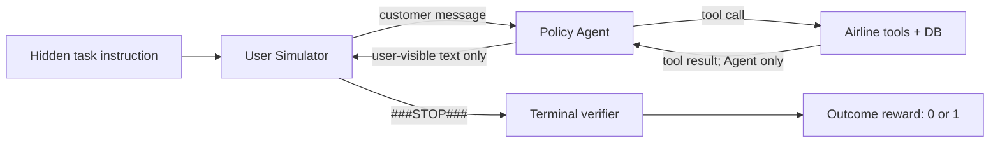
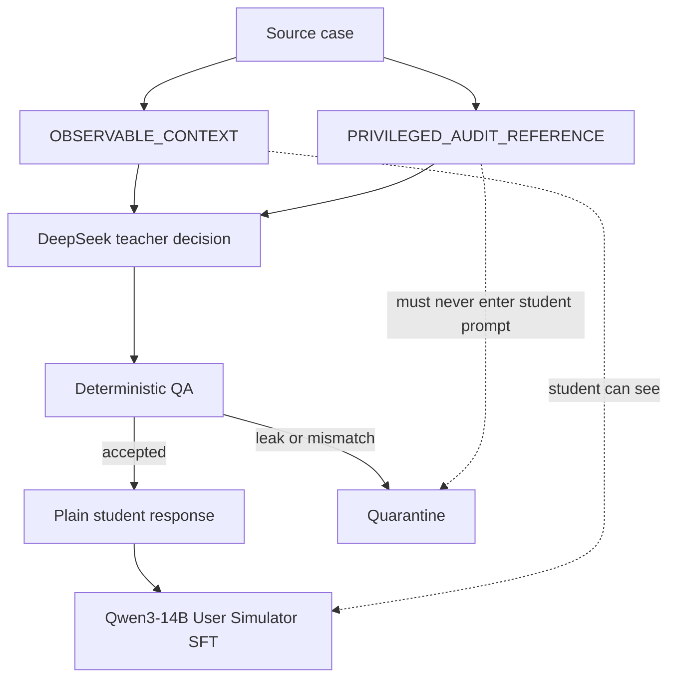
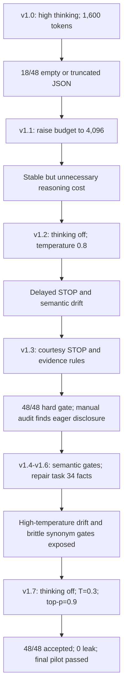

# 面试专题：从 Delayed STOP 到可控 User Simulator

> - 项目：τ-bench Airline 多轮工具 Agentic RL
> - 主 Policy：Qwen3-8B
> - User Simulator：Qwen3-14B
> - Teacher：DeepSeek V4 Flash
> 当前状态：16 个关键边界 case × 3 次真实采样的 pilot 已 48/48 通过；按阶段要求，1,527-case 全量生成和 Qwen3-14B 微调尚未执行。

这份 README 不是把一次 Prompt 调优包装成算法工作，而是说明：在多轮 Agentic RL 中，User Simulator 为什么是环境动力学的一部分，它会怎样决定训练上限，以及如何从真实坏例、数据合同、Prompt Engineering、可执行门禁和在线评估五个层面把它做对。

---

## 1. 面试先给结论

### 1.1 一句话版本

> User Simulator 不是陪 Agent 聊天的辅助模型，而是多轮 RL 的 observation generator 和 termination policy；它会改变 episode 长度、状态访问分布、reward 结算时机和策略学到的行为边界，所以 delayed STOP、premature STOP、信息泄漏和过度配合都会系统性污染 on-policy rollout。

### 1.2 30 秒版本

> 项目里出现了两个表面相似的问题：业务已经完成后 User Simulator 迟迟不输出 `###STOP###`，以及工具动作结束后 Agent 和 User 继续循环。我没有把两者简单归因成“User 太差”，因为 task 34 里很多继续追问其实是合理的：数据库动作虽然完成，但 Agent 没有给出用户要求的精确总价，甚至输出了 malformed 文本。正确目标不是让 User 更早停止，而是学习一个严格边界：所有显式和条件目标都完成、且结果已经向用户完整告知时才 STOP；否则继续推动未完成目标。我们用 16 类边界 case、DeepSeek V4 Flash 三次稳定性采样、observable/privileged 隔离和 case-specific semantic gate 做了七轮迭代，最终 48/48 通过，同时保留合理的语言多样性。

### 1.3 两分钟标准回答

> 我先从环境语义开始检查。当前 τ-bench User Simulator 只看到完整用户 instruction、Agent 发给用户的自然语言，以及自己的历史回复；它看不到 Agent 的 tool call 和 tool result。只有 User 输出 `###STOP###`，环境才正常结束并调用 terminal verifier。所以 STOP 既不是普通文本，也不等价于 success，它是一个会决定 reward 何时结算的 action。
>
> 数据审计又发现两个问题。第一，当前主 Agent 的 80 条成功 SFT 轨迹只覆盖 19/50 个任务，而且 wrapper 没有保存 terminal user observation，因此这 80 条里没有一个 `###STOP###`，不能直接拿来训练 User Simulator。第二，仓库内 400 条官方 airline 历史轨迹中，reward 和 STOP 明显不是同一标签：reward=1 的 184 条里只有 92 条包含 STOP；reward=0 的 216 条里反而有 171 条包含 STOP。这说明不能把成功轨迹末尾自动标 STOP，也不能把历史 STOP 当成 goal satisfied。
>
> 我把错误分成五类：真正的 delayed STOP、Agent 漏报 user-facing output、Agent malformed/重复、task/verifier coverage gap、以及正常的 conditional fallback。然后从 seen task 中设计 16 个最小边界 case，覆盖 task 0 的 reactive disclosure、task 1 的 unknown ID 和 cancellation fallback、task 2 的五个 reservation 与 total savings、task 4 的 baggage 漏项、task 34 的 temporal trigger、malformed total 和 persistent persona。
>
> Teacher 输出富 JSON 做审计，但 Student target 只有一句自然用户回复或精确 `###STOP###`。Prompt 使用 runtime-observable context，gold action/tool trace 只做 privileged audit，并由校验器防止实体泄漏。真实 pilot 里 high thinking 首版只有 30/48 accepted，根因是 reasoning 挤占 1,600 output token；关闭 thinking 后解决格式问题，但 temperature=0.8 又引入过度披露和 delayed STOP。最终使用 thinking off、temperature=0.3、top-p=0.9，再加可执行语义门禁，得到 48/48 decision match、12/12 精确 STOP、36/36 合理 CONTINUE、0 泄漏。
>
> 最后我不会只看 User Simulator 的离线 F1。真正放行要固定 Policy checkpoint 做在线 A/B，同时看 premature STOP、late-STOP latency、post-tool loop、terminal success、pass@k/pass^k 和 cross-simulator robustness。否则 Policy 可能只是在适应一个更容易的模拟用户，而不是 Agent 能力真正提升。

---

## 2. 先纠正一个关键认知：两个循环现象只部分同源

用户最初的判断是：

```text
User Simulator 迟迟不 STOP
        +
工具完成后 Agent/User 继续循环
        =
User Simulator 效果不好
```

这个判断抓住了一部分根因，但不能直接作为数据标签策略。

### 2.1 真正同源的部分

当同时满足：

1. 所有显式目标已经完成；
2. 所有 conditional fallback 已经处理；
3. Agent 已向用户清楚说明结果；
4. 不再有 active subgoal；

而 User 仍然回复“好的，那再确认一下”“谢谢，所以已经完成了吗”，这才是 User Simulator 的 delayed STOP。

它会造成：

- 终局 reward 延迟结算；
- 无意义 response token 增加；
- Agent 在任务结束后继续生成，进入 repetition 或 malformed tool call；
- rollout 达到 max turn/token limit，原本可成功的轨迹被污染；
- 训练吞吐下降；
- GRPO 同组轨迹的环境噪声增大。

### 2.2 不同源的部分

如果数据库状态完成，但 Agent 漏掉用户要求的结果，User 继续追问是正确行为。

例如：

```text
Agent 已完成五个 reservation 的 downgrade
但没有告诉用户 total savings
```

这时正确 User response 是：

```text
Great, but what's the total savings?
```

而不是：

```text
###STOP###
```

同样，如果 Agent 输出：

```text
The total_cost: 24-0596054-05405964664-05 <tool_call>
```

User 继续要求一个可读数字也是合理的。把这类轨迹训练成 STOP，会让主 Agent 学到一个危险捷径：

```text
只要 DB 大致改对，最终回答即使漏项或损坏，用户也会结束。
```

### 2.3 面试中的标准归因表

| 观测现象 | 根因 | User 应该做什么 | 应优化谁 |
|---|---|---|---|
| 所有目标完整告知后仍继续 | User termination calibration | STOP | User Simulator |
| DB 成功，但总价/节省/状态未告知 | Agent communication gap | CONTINUE | Policy、communication reward、verifier |
| Agent 文本乱码或 tool call 损坏 | Policy/context/tool observation | CONTINUE 或按 persona 放弃 | Policy、context、decode |
| Agent 只完成 compound goal 的一部分 | Policy planning/credit assignment | CONTINUE | Policy、PRM/turn credit |
| 用户忘记 ID，Agent 要求提供 | 正常信息边界 | 请求按账户查找，不虚构 | User Simulator factuality |
| basic economy 不可修改，但 instruction 有 fallback | 正常条件分支 | 触发 fallback | User Simulator task adherence |
| instruction 要求结果，但 verifier 没检查 | evaluator coverage gap | 仍坚持用户目标 | Task/verifier contract |

面试时最能体现功力的一句话是：

> 我优化的不是 STOP rate，而是 STOP 的条件分布；高 STOP rate 可能只是更早放弃，高 success 也可能只是 verifier 没检查用户可见输出。

---

## 3. 从 RL 视角看，User Simulator 到底是什么？

### 3.1 它是环境转移核的一部分

将 Agent 在第 (t) 个决策点看到的对话历史记为 (h_t)，Agent 动作为 (a_t)，User Simulator 参数为 (phi)，则下一条用户 observation 可以写成：

\[
u_{t+1} \sim P_{\phi}(u \mid I, h_t, a_t)
\]

其中 (I) 是隐藏的用户 instruction/persona。终止决策为：

\[
d_{t+1} = \mathbb{1}[u_{t+1}=\texttt{\#\#\#STOP\#\#\#}]
\]

于是训练环境的实际转移不是只有 tool/database：

\[
P(s_{t+1} \mid s_t,a_t)
=
P_{tool}(x_{t+1}\mid s_t,a_t)
\cdot
P_{\phi}(u_{t+1}\mid I,h_t,a_t)
\]

更换 User Simulator，会改变：

- Policy 实际访问到的状态分布；
- episode horizon；
- fallback、确认、拒绝、澄清出现的概率；
- terminal verifier 被调用的时机；
- 同一 task 的 rollout 难度和 reward 方差；
- Policy 可以利用的 simulator shortcut。

因此，User Simulator 不是普通的数据增强组件，而是训练 MDP/POMDP 的组成部分。

### 3.2 它同时扮演五个角色

| 角色 | 需要学会什么 | 失败后果 |
|---|---|---|
| Goal carrier | 持续保留显式、条件和时序目标 | 中途忘记子目标，虚假成功 |
| Observation generator | 根据 Agent 最新回复产生真实用户反应 | 反馈不自然、Agent 学不到修复能力 |
| Information gate | 渐进披露，不虚构、不提前泄漏 | benchmark 变简单，Policy 依赖 privileged shortcut |
| Counterparty | 确认、拒绝、澄清、触发 fallback | write policy 和确认语义失真 |
| Termination policy | 在正确边界输出 STOP | reward timing 和 episode length 被污染 |

### 3.3 STOP precision 和 recall 的代价不对称

定义“真实已完整完成”为 (y=1)，Simulator 输出 STOP 为 (hat y=1)：

\[
\text{STOP Precision}=P(y=1\mid \hat y=1)
\]

\[
\text{STOP Recall}=P(\hat y=1\mid y=1)
\]

- precision 低：premature STOP。任务被提前截断，原本可完成的 trajectory 通常直接失败；这是更危险的错误。
- recall 低：delayed STOP。任务已完成但继续交互，增加成本，并可能把成功轨迹拖入退化循环。

因此训练时不能为了修 delayed STOP 盲目提高 STOP recall。合理优先级是：

```text
先确保 STOP precision
    → 再提高 STOP recall
    → 再压缩 late-STOP latency
```

### 3.4 STOP 不等于 reward

仓库内官方 airline 历史数据共有 50 task × 8 trial = 400 条 trajectory：

| | 有 STOP | 无 STOP | 合计 |
|---|---:|---:|---:|
| reward=1 | 92 | 92 | 184 |
| reward=0 | 171 | 45 | 216 |
| 合计 | 263 | 137 | 400 |

这张表非常关键：

- 有 STOP 的 263 条里，171 条 reward=0；
- reward=1 的 184 条里，有一半没有 STOP；
- historical STOP 只能说明对话终止，不能说明目标成功；
- terminal verifier success 也不能自动推导“最后一次 Agent 回复已经让用户满意”。

所以数据构造时必须重新判断，而不是复制历史标签。

---

## 4. 当前 τ-bench Airline 的真实运行语义

### 4.1 User Simulator 能看到什么？

当前 [`LLMUserSimulationEnv`](../../tau-bench/tau_bench/envs/user.py) 看到：

1. 完整用户 instruction；
2. Agent 发给用户的自然语言；
3. User Simulator 自己此前的回复。

它看不到：

- Agent 的内部推理；
- Agent tool call；
- tool result；
- 数据库真实状态；
- verifier gold action/output；
- terminal reward。

这意味着 Simulator 必须像真实客户一样，只根据 Agent 的用户可见表达判断是否满意。

### 4.2 正常终止如何发生？

[`Env.step()`](../../tau-bench/tau_bench/envs/base.py) 的核心语义是：

```python
observation = self.user.step(agent_text)
done = "###STOP###" in observation

if done:
    reward_res = self.calculate_reward()
```

所以：



如果 User 不 STOP，正常 terminal verifier 可能迟迟不结算；如果 User 过早 STOP，后续必要 action 根本没有机会发生。

### 4.3 为什么当前 Policy SFT 轨迹不能直接反转成 User 数据？

当前 `experiments/sft_collect_airline` 有 80 条筛选后的成功轨迹：

- 只覆盖 19/50 task；
- 80/80 没有保存 terminal user response；
- 57 条以 assistant 结束；
- 23 条以 tool 结束；
- 训练 messages 中 `###STOP###` 出现 0 次。

原因是 [`TauBenchWrapper.run_single_task()`](../../agentic-grpo-longhorizon/src/envs/tau_bench_wrapper.py) 在 `user_obs.done=True` 时只累计 reward，没有把 terminal observation append 回 messages。

这批数据适合主 Agent SFT，但不能提供 User Simulator 最关键的 STOP label。

---

## 5. 数据设计：不是多收闲聊，而是覆盖决策边界

### 5.1 数据来源和切分

第一版优先使用同域数据：

- 官方 `sonnet-35-new-airline.json`：400 条历史 trajectory；
- 16 条人工 curated pilot；
- 当前固定 split：40 seen task、10 unseen task；
- 去重后：1,527 个 seen teacher-generation case；
- 424 个 unseen audit case，程序强制禁止发给 teacher 或进入微调。

为什么不先混 MultiWOZ/Schema-Guided Dialogue？

因为第一阶段要校准的是 airline 的：

- STOP/CONTINUE；
- tool-visible/hidden state；
- write confirmation；
- conditional fallback；
- compound goal；
- user-facing amount/status；
- temporal trigger。

通用 TOD 数据可以增加语言风格，但它的 state、slot、工具可见性和终止定义不同，过早混入可能稀释最关键的边界信号。

### 5.2 数据目标不是固定 STOP 比例

训练集不应该追求“STOP 和 CONTINUE 各 50%”。合理目标是覆盖困难边界：

```text
完全完成 vs 只完成 DB
完全告知 vs 漏掉 required output
待确认 vs 已执行
首次 malformed vs 持续 malformed
当前目标 vs 条件 fallback
初始 disclosure vs 被问后的必要 disclosure
记得 ID vs instruction 明确说不记得 ID
```

STOP 可以在 train 中适度 oversample，因为它是稀疏且关键的控制 token，但 eval 必须保留自然分布，否则 termination F1 没有解释力。

### 5.3 Teacher 富标签，Student 只学自然回复

Teacher 输出：

```json
{
  "decision": "continue",
  "is_over": false,
  "termination_reason": "continue",
  "goal_status": "in_progress",
  "communication_status": "partial",
  "response": "Great, but what's the total savings?",
  "resolved_goals": ["all five downgrades"],
  "unresolved_goals": ["exact total savings"],
  "evidence": [
    {
      "turn_index": 1,
      "fact": "The agent confirmed all downgrades but did not state the total."
    }
  ]
}
```

结构字段用于：

- QA；
- 错误归因；
- STOP/CONTINUE 分类；
- communication completeness；
- evidence 可追溯性；
- quarantine。

真正给 Qwen3-14B 的 target 只有：

```json
{"role": "assistant", "content": "Great, but what's the total savings?"}
```

或者：

```json
{"role": "assistant", "content": "###STOP###"}
```

这避免 Student 学会输出审计 JSON，也保持与现有 runtime parser 完全兼容。

### 5.4 Observable 与 Privileged 必须分层



Privileged reference 可以帮助 Teacher 审计：

- gold actions；
- required outputs；
- tool trace；
- trajectory reward；
- hidden entity list。

但生成的现实用户回复只能使用 observable information。校验器会拦截未在 scenario/history 出现的 reservation、flight、payment 等实体。

面试时可以这样解释：

> Privileged reference 类似训练时 critic 可以使用的额外信号，但不能进入 actor observation；否则不是提升 Simulator，而是改变 benchmark 可观测性。

---

## 6. 五个真实 Task 的逐案穿刺

### 6.1 Task 0：Reactive 用户不是“把 instruction 全念一遍”

#### 业务目标

用户要订 New York 到 Seattle 的单程票，还包含：

- May 20；
- 11am 以后；
- economy；
- direct 优先、one stop 可接受；
- lowest price；
- 3 bags；
- no insurance；
- certificate + 7447 card；
- birthday 在 profile；
- persona 明确是 reactive、没问不说。

#### 初始问题

早期 high-temperature teacher 会在第一轮输出：

```text
I'd like to book New York to Seattle after 11am in economy,
direct if possible, with three bags, no insurance,
using my certificate and card ending 7447.
```

这虽然没有虚构，但违反了“reactive、只披露当前必要信息”，会让主 Agent 的训练环境过于简单。

#### 修改

Prompt 加入：

```text
If the customer is reactive:
- first turn only states the high-level request;
- after a direct question, answer only the requested field;
- do not dump payment, baggage, insurance, birthday, identifier,
  and itinerary preferences into the opening turn.
```

同时增加 case-specific gate：

```json
{
  "must_include_any_of_each": [
    ["book", "flight"],
    ["new york", "nyc", "jfk"],
    ["seattle", "sea"],
    ["may 20", "may 20th"]
  ],
  "must_not_include": [
    "11am",
    "economy",
    "direct",
    "bag",
    "insurance",
    "certificate",
    "7447"
  ]
}
```

#### 最终表现

三次采样都只输出类似：

```text
I'd like to book a one-way flight from New York to Seattle on May 20, please.
```

后续被问 user ID 才回答：

```text
My user ID is mia_li_3668.
```

被问 DOB 时不泄漏 gold DOB，而是回答：

```text
It's already in my profile.
```

Agent 提交 write action 前请求确认时：

```text
Yes, that's correct.
```

只有 Agent 明确告知 reservation、航班、行李、保险和 payment 都完成后，才输出：

```text
###STOP###
```

#### 算法意义

这个 case 同时训练四种能力：

1. progressive disclosure；
2. necessary slot answering；
3. hidden/profile information boundary；
4. confirmation 与 terminal completion 的区分。

### 6.2 Task 1：Unknown ID 与 Conditional Fallback

#### Unknown reservation ID

Instruction 明确说用户不记得 reservation ID。Agent 问 ID 时，错误 Simulator 可能：

- 从 gold action 偷看 `Z7GOZK`；
- 随机编一个 ID；
- 直接 STOP；
- 机械重复原请求。

正确回复是：

```text
I don't remember the reservation ID. Can you look it up under my name?
```

校验器将真实 gold ID 放进 `privileged_entities`。如果 response 中出现该 ID，而 scenario/history 没出现，就 quarantine。

#### Basic-economy fallback

用户主目标是把返程改到更晚的 EWR 航班。如果 basic economy 无法修改，instruction 明确给出 fallback：因身体不适，使用 travel insurance 取消，之后重新订。

Agent 说无法修改后，User 不能：

```text
###STOP###
```

而应触发：

```text
Then please cancel the trip using my travel insurance.
```

Agent 明确确认 cancellation 和 refund 后才 STOP。

#### 算法意义

这说明 Simulator 不是简单 intent classifier，而是一个带条件分支的 goal-state tracker：

\[
g_{primary}\ \text{blocked}
\Rightarrow
g_{fallback}\ \text{activated}
\]

如果 Simulator 没学会 fallback，Policy 永远收集不到这类后续 rollout，主 Agent 也学不会 recovery policy。

### 6.3 Task 2：DB Success 不等于 Communication Complete

#### 业务目标

用户要求：

1. 五个 business reservation 全部 downgrade 到 economy；
2. 不改变 flights/passengers；
3. refund 到各自原支付方式；
4. 告知 total savings：`$23,553`。

#### 三个必须区分的状态

##### 状态 A：只完成三个 reservation

```text
Agent: I have downgraded three of the five reservations.
```

User：

```text
Yes, continue with the remaining two and let me know the total savings.
```

##### 状态 B：五个 DB action 都完成，但没说 total savings

```text
Agent: All five reservations have been downgraded and refunds are going
to the original payment methods.
```

User：

```text
Great, but what's the total savings?
```

##### 状态 C：所有 action 和 output 都完整告知

```text
Agent: ... Your exact total savings are $23,553.
```

User：

```text
###STOP###
```

#### 算法意义

需要维护两个不同状态变量：

\[
z_t^{env}=\text{environment/database completion}
\]

\[
z_t^{comm}=\text{user-visible communication completion}
\]

合理 STOP 是：

\[
STOP \iff z_t^{env}=1 \land z_t^{comm}=1
\]

仅用 verifier DB hash 训练 User，会漏掉 (z_t^{comm})，让 Policy 学会“做完但不说完”。

### 6.4 Task 4：Agent 的 False-complete Claim 不能骗过 User

用户要求三项修改：

1. passenger 改成 Omar Rossi；
2. cabin 改成 economy；
3. 增加 three checked bags。

Agent 回复：

```text
The passenger is now Omar Rossi and the cabin is economy. Everything is complete.
```

User 不能因为 Agent 说了 `Everything is complete` 就 STOP。它需要对照自己的 goal ledger，发现 baggage 未覆盖：

```text
You mentioned the passenger and cabin, but what about the three checked bags?
```

这类 case 防止 Simulator 把 Agent 的自我声明当成事实真值。

### 6.5 Task 34：最能体现多轮 User Simulator 功力的 Case

#### 完整目标

1. 取消 `XEHM4B`；
2. 取消 `59XX6W`；
3. 如果 basic economy，先升级 economy；
4. 第三个 Agent 消息后，询问其他 upcoming flights；
5. 询问这些 flights 的 total cost；
6. persona：persistent、terse、clear。

#### 边界一：Temporal Trigger

这个子目标不能在第一轮提前说出。只有第三个 Agent message 后才应出现：

```text
What other flights do I have coming up, and what's the total cost?
```

这说明 scenario 不只是静态 slot 集合，还包含基于 interaction count 的触发逻辑。

#### 边界二：Malformed Agent Answer

Agent 给出：

```text
The total_cost: 24-0596054-05405964664-05 <tool_call>
```

因为 persona 是 persistent，正确 User response 是：

```text
That's not a number. Give me the exact total.
```

多次 malformed 后仍然可能继续：

```text
I need the exact total cost as a single number, not a code.
```

这里的继续循环主要暴露 Policy degeneration，不是 delayed STOP。

#### 边界三：Evaluator Coverage Gap

task 34 的 `Task.actions` 包含 `calculate`，但 `Task.outputs=[]`。如果 verifier 只看最终 DB hash，Agent 可能在没有正确告诉用户总价时仍得到 success。

因此不能用 verifier success 直接监督 User STOP，否则 User Simulator 会替 evaluator gap 背书。

#### 边界四：Pilot 反向发现了人工 Case 错误

早期 complete case 写成：

```text
7WPL39
3EMQJ6
total = $1,016
```

但真实数据是：

```text
7WPL39 = $402
3EMQJ6 = $306
A90KR2 = $308
total  = $1,016
```

\[
402+306+308=1016
\]

漏掉 `A90KR2` 时，Teacher 继续询问是合理的，不能强行改 Prompt 让它 STOP。我们修复了输入 case，明确列出三条 upcoming reservation，并说明没有其他 upcoming flight，之后 STOP 才稳定。

这体现了一个很重要的工程判断：

> Teacher pilot 既是在测模型，也是在测人造数据；模型与标签冲突时，先审计事实，不能默认标签永远正确。

---

## 7. Prompt Engineering：从参考模板到可训练合同

### 7.1 骑手模拟器模板中可以迁移什么？

可迁移的是：

- 角色设定；
- 当前情境；
- 核心诉求；
- persona/style；
- 对话历史；
- 一次只回复一轮；
- 判断是否结束；
- 不重复；
- 不虚构。

不能直接照搬的是：

- “客服方案可接受就结束”过于主观；
- `IsOver=True` 没有与 τ-bench 的精确 `###STOP###` 对齐；
- 没有区分 DB completion 和 communication completion；
- 没有 conditional fallback、write confirmation、temporal trigger；
- 没有 observable/privileged 隔离；
- 没有防止 gold entity 泄漏；
- 没有为主 Agent RL 考虑 reward timing 和 state distribution。

### 7.2 最终决策规则

\[
\text{STOP} \iff
\text{all explicit goals resolved}
\land
\text{all active conditional goals resolved}
\land
\text{all required results communicated}
\land
\text{no pending confirmation/fallback}
\]

不是：

\[
\text{STOP} \Leftarrow \text{某个 write tool 成功}
\]

也不是：

\[
\text{STOP} \Leftarrow \text{Agent 声称 everything is complete}
\]

### 7.3 Prompt 中最关键的七条指令

1. 展开所有 explicit、conditional、temporal 和 user-facing goal；
2. 只根据用户可见对话判断 communication；
3. partial completion 不 STOP；
4. Agent 请求确认时要确认，不 STOP；
5. fallback 可用时继续触发 fallback；
6. 全部完成后直接 STOP，不添加礼貌尾轮；
7. 语言多样性只能改变表面形式，不能改变实体、金额、确认、未决目标和终止边界。

### 7.4 为什么还需要可执行 Semantic Gate？

只写 Prompt 存在两个问题：

- 模型可能在大多数 case 遵守，但在随机采样中偶尔漂移；
- 人工目检一次通过，后续 Prompt 版本可能回归。

因此 curated pilot 增加：

```text
must_include_any_of_each
must_not_include
max_chars
expected_decision
privileged entity leak check
evidence turn check
```

每个 required group 是同义词 OR-set，而不是固定句子，例如：

```json
[
  ["don't remember", "don't have", "not remember"],
  ["look", "find", "account", "under my name"]
]
```

这样既能接受自然改写，又能阻止语义偏移。

---

## 8. DeepSeek Pilot 的真实七轮迭代



### 8.1 v1.0：不是判断错，而是输出预算错

配置：

```text
thinking = high
max_tokens = 1600
```

结果：

- 30/48 accepted；
- 12 个 empty content；
- 6 个截断/不完整 JSON；
- 成功样本 completion token P90=1,408；
- 最大=1,574，几乎撞上 1,600。

结论：先区分模型能力问题和 API/output contract 问题，不能看到 rejected 就继续堆 Prompt。

### 8.2 v1.1：加大 token 能跑，但不代表合理

把 `max_tokens` 提到 4,096 后，已返回的 31 条都 accepted，证明 v1.0 的主要问题确实是 reasoning 截断。

但 User Simulator teacher 只需要严格 JSON 和一句短回复，长 reasoning 带来的成本、延迟和不可审计性没有必要。因此没有把“大 context 解决一切”作为最终方案。

### 8.3 v1.2：关闭 Thinking 后格式稳定，但高温破坏语义

配置：

```text
thinking = false
temperature = 0.8
top_p = 0.95
```

格式问题消失，但出现：

- complete fallback 后仍继续；
- reactive 首轮过度披露；
- compound goal 重复追问。

结论：User Simulator 数据不是创意写作，语义稳定性优先于措辞丰富度。

### 8.4 v1.3：硬门禁通过，人工审计仍发现问题

增加：

- 空 conversation 时 `evidence=[]`；
- 完成后 STOP 取代 thanks/再次确认；
- reactive disclosure 规则。

得到 48/48 hard-contract pass，但人工审计发现一个首轮样本仍提前披露 time/cabin/connection/price。

结论：JSON 和 decision 全对，仍不代表训练数据行为正确。

### 8.5 v1.4–v1.6：把人工判断变成机器门禁

新增 case-specific semantic constraints 后：

- 成功拦截初始过度披露；
- 暴露 unknown-ID 同义词规则过窄；
- 暴露 task 34 complete case 事实不完整；
- 暴露 high temperature 的终止漂移。

我们没有删除难 case，也没有放宽 STOP 标准，而是修正事实、扩大合理同义词集合，并降低采样温度。

### 8.6 v1.7：最终通过

```json
{
  "model": "deepseek-v4-flash",
  "thinking": false,
  "temperature": 0.3,
  "top_p": 0.9,
  "max_tokens": 1600,
  "prompt_version": "tau-airline-usim-teacher-v1.4"
}
```

| 指标 | 最终值 |
|---|---:|
| accepted | 48 / 48 |
| expected decision match | 48 / 48 |
| STOP | 12 / 12 精确 `###STOP###` |
| CONTINUE | 36 / 36 |
| JSON parse/non-empty | 48 / 48 |
| privileged leak | 0 |
| semantic gate violation | 0 |
| `quality_gate_passed` | true |

---

## 9. 对多样性和泛化性的正确理解

### 9.1 多样性有两个层次

#### State diversity

不同：

- task；
- persona；
- goal composition；
- history length；
- Agent 成功/失败阶段；
- fallback 状态；
- confirmation 状态；
- malformed/partial/complete 边界。

这是最有价值的多样性，因为它扩展环境状态覆盖。

#### Surface diversity

同一语义下变化：

- contractions；
- 句式；
- 礼貌程度；
- persona 对应的简洁/愤怒/坚持；
- 同义表达。

这是次要多样性，不能修改任务事实。

### 9.2 不应追求的“伪多样性”

- 把正确金额换成近似金额；
- 改 reservation ID；
- 把明确确认改成含糊同意；
- STOP 后增加 thanks；
- 为了避免重复，把一句简单问答扩成闲聊；
- 对同一个 incomplete state 随机 STOP；
- 把 persistent persona 随机改成放弃。

### 9.3 Pilot 的多样性结果

36 条 CONTINUE：

- 25 条不同的规范化文本；
- exact duplicate rate 30.56%；
- 排除必须固定回答的 user ID 后，11 个可变 case 组中 9 个有多种表达。

重复不是自动缺陷：

```text
My user ID is mia_li_3668.
```

这类 exact slot answer 越稳定越好。

### 9.4 泛化不能只在同一个 Simulator 上证明

真正的泛化评估至少包括：

1. seen task、同 User Simulator；
2. unseen task、同 User Simulator；
3. seen/unseen task、强外部 Simulator；
4. 最好再有人类或规则校验的边界集。

如果 Policy 只在 fine-tuned User Simulator 下 reward 提升，换成原 Simulator 或强 Simulator 就下降，说明发生了 co-adaptation 或 simulator exploitation。

---

## 10. 微调设计：为什么这样训练 Qwen3-14B

> 以下是已经实现的训练方案，不是已经跑出的训练结果。

### 10.1 只训练最后一个 Assistant Turn

在 role-flipped User Simulator 对话中：

- `user` role：Agent 发给模拟用户的话；
- `assistant` role：模拟用户回复。

历史早期 user-simulator 回复可能来自原始 trajectory，并没有经过当前 Teacher 重新审核。如果对所有 assistant turn 计算 loss，会把未审核历史也当 gold target。

所以新增：

```yaml
loss_mask_mode: last_assistant
```

只监督 DeepSeek 新生成的最后一轮，历史仅作为 context。

### 10.2 为什么从 2 Epoch 开始

配置起点：

```text
Qwen3-14B
LoRA r=32, alpha=64
max_length=16K
global batch=32
learning rate=5e-5
epochs=2
enable_thinking=false
```

不直接跑 5 epoch 的原因：

- 数据规模只有约两千级；
- 相同 task instruction 在不同历史状态中重复；
- STOP 是非常特殊的 exact token；
- 过训容易记住 task wording；
- 过训可能提高离线 STOP recall，却降低自然用户表达和 unseen 泛化。

checkpoint 选择不能只看 train loss，要看：

- STOP precision/recall；
- late-STOP latency；
- fallback accuracy；
- progressive disclosure；
- entity hallucination；
- 在线 Agent success。

### 10.3 STOP Oversampling 的边界

STOP 在 train 中可以适度重复以提高边界学习，但：

- 只在 train oversample；
- eval 保持自然分布；
- 不把 DB success 但 communication incomplete 的 case 改成 STOP；
- 不追求固定 50/50；
- 用 precision 和 latency 联合选 checkpoint。

---

## 11. User Simulator、Verifier、PRM 和 Judge 的职责边界

### 11.1 四者不能混为一谈

| 组件 | 输入 | 输出 | 主要职责 |
|---|---|---|---|
| User Simulator | instruction + 用户可见历史 | 下一条用户消息/STOP | 环境 observation 与终止 |
| Tool/DB environment | tool call + state | tool result/state transition | 执行业务动作 |
| Terminal verifier | 最终 DB/output | outcome 0/1 | 判定 benchmark 完成 |
| PRM/Judge | trajectory/turn/action | process score/诊断 | 信用分配或质量评估 |

### 11.2 为什么不能让 User Simulator 直接当 Verifier？

User 只能根据 Agent 文本判断，不知道 tool 是否真实执行成功。如果 Agent 说“已取消”但 DB 实际失败，现实用户可能 STOP，但 terminal verifier 应给 0。

反过来，DB 成功但 Agent 没告诉用户 total savings，verifier 可能给 1，User 仍应 CONTINUE。

两者监督对象不同：

```text
User Simulator：用户是否认为对话应该继续
Verifier：环境目标是否真实完成
```

### 11.3 为什么不能用 User Simulator 修 PRM/credit assignment 的问题？

如果 Agent 前三步做对、最后一步写错，User 可以表现不满，但它无法准确告诉 optimizer 哪个 tool/action token 导致失败。这个问题仍需要：

- Turn-PPO；
- TRACE-style prefix credit；
- learned PRM；
- rule-based PRM-Lite；
- action-level verifier。

好的 User Simulator 可以提供更真实的环境反馈，但不能替代 turn-local credit assignment。

### 11.4 为什么 User Simulator 会影响 PRM 上限？

PRM 学的是训练分布中的过程质量。如果 Simulator：

- 很快放弃；
- 总是配合；
- 从不触发 fallback；
- 提前泄漏 ID；
- 完成后继续制造噪声；

那么 PRM 看到的 positive/negative step 分布也会偏移。Simulator 的上限决定了 Policy 和 PRM 能接触到多难、多真实的交互状态。

---

## 12. 评估闭环：User 离线变好，不代表 Agentic RL 一定变好

### 12.1 离线 User 指标

| 指标 | 定义/关注点 |
|---|---|
| STOP precision | 输出 STOP 时是否真的全部完成；最高优先级 |
| STOP recall | 完全完成后是否及时 STOP |
| late-STOP latency | 首次 complete 到实际 STOP 的额外 User turn 数 |
| premature STOP rate | 仍有 unresolved goal 时 STOP 的比例 |
| fallback accuracy | 条件满足后是否触发正确 fallback |
| progressive disclosure | 是否只披露当前必要信息 |
| entity hallucination | 是否生成 scenario/history 没有的事实 |
| privileged leakage | 是否使用 gold/tool-only entity |
| repetition rate | 是否重复上一条用户请求 |
| response relevance | CONTINUE 是否推动 unresolved goal |
| persona consistency | persistent/reactive/terse 等是否稳定 |

### 12.2 在线 Frozen-policy A/B

固定：

- 同一个 Policy checkpoint；
- 同一 task split；
- 同一 seed；
- 同一 rollout 数；
- 同一 max turn/token；
- 同一 tool schema；

只替换：

```text
原 Qwen3-14B User Simulator
vs
微调后 Qwen3-14B User Simulator
```

报告：

- terminal success；
- pass@1、pass@k、pass^k；
- normal STOP rate；
- premature STOP；
- late-STOP latency；
- max-turn termination；
- post-final-tool User turns；
- malformed tool/text rate；
- repeated read/tool calls；
- average trajectory tokens；
- task 34 communication coverage。

### 12.3 Cross-simulator Evaluation

至少再使用一个更强、未参与训练的 Simulator。理想结果是：

```text
训练 Simulator 下更好
    且
原 Simulator 下不退化
    且
强 Simulator/真人下仍提升
```

只在新 Simulator 下提升，可能是：

- Policy 学会新 Simulator 的固定措辞；
- Simulator 变得更配合；
- premature STOP 让任务变短；
- environment reward 被人为变容易。

### 12.4 一个可信的消融表

| 组 | User 模型 | STOP 数据 | Semantic gate | 目的 |
|---|---|---|---|---|
| A | 原 Qwen3-14B | 原始 | 无 | baseline |
| B | SFT Qwen3-14B | 仅自然历史 | 无 | 检验普通 SFT |
| C | SFT Qwen3-14B | curated STOP boundary | 无 | 检验终止数据价值 |
| D | SFT Qwen3-14B | curated + historical teacher | 有 | 完整方案 |
| E | DeepSeek teacher online | N/A | teacher contract | 环境上限参考，不作为最终部署 |

每组至少固定 task-level bootstrap 或多个 seed，不能只比较一次平均 reward。

---

## 13. 工程上为什么先 Pilot，不直接全量生成？

### 13.1 错误会被批量放大

如果 Prompt 在 5% case 上 premature STOP，1,527 条数据可能产生约 76 个错误边界；再对 STOP oversample，会进一步放大。

### 13.2 Pilot 要覆盖“最危险边界”，不是随机抽 16 条

当前 16 类包括：

- initial disclosure；
- hidden/profile fact；
- explicit confirmation；
- complete STOP；
- partial multi-action；
- state done/output missing；
- required output complete；
- temporal trigger；
- compound completion；
- malformed recovery；
- persistent loop；
- conditional fallback；
- fallback completion；
- false-complete claim；
- unknown ID。

它们是按风险设计的 adversarial boundary suite，不是为了代表自然频率。

### 13.3 Release Gate

Pilot 必须：

```text
48/48 JSON parse
48/48 accepted
48/48 expected decision match
0 privileged leak
0 hard-contract error
0 semantic-gate violation
人工复核 task 0/2/34
```

任一失败：

1. 按 category 归因；
2. 修改最小 Prompt/contract/case；
3. 使用新版本输出；
4. 不覆盖旧结果；
5. 重新跑 3 次稳定性测试。

### 13.4 可复现和安全

管线保存：

- prompt version；
- input SHA256；
- split IDs；
- model；
- thinking；
- temperature/top-p；
- max tokens；
- token usage；
- accepted/quarantined/rejected；
- quality issues。

不保存：

- API key；
- Authorization header；
- provider private reasoning；
- 未授权的 unseen generation。

---

## 14. 常见面试追问与回答

### 追问 1：为什么不直接写规则，在 verifier 成功时强制 STOP？

> 因为 verifier success 和用户可见完成不是同一个事件。DB 成功但 total savings 没说，用户仍应继续；Agent 声称成功但 DB 失败，用户可能 STOP、verifier 仍应给 0。可以把 verifier-ready 作为诊断信号，但不能直接注入 User observation，否则泄漏环境真值并改变 benchmark。

### 追问 2：为什么不把所有长循环都标成 STOP？

> 长度是症状，不是标签。task 34 的 persistent 用户在 Agent 连续给乱码总价时继续追问是正确的。如果把它标 STOP，主 Agent 会把 malformed final answer 当成可接受行为。要先判断 unresolved goal 是否仍存在。

### 追问 3：User Simulator 为什么影响 RL 上限？

> 它定义了环境转移的一部分。它决定 Policy 会遇到哪些澄清、拒绝、fallback 和确认状态，也决定 reward 何时结算。过于配合的 User 会让 Policy 学会 shortcut；过度坚持的 User 会制造无意义 horizon；提前泄漏会降低任务难度。Simulator 的真实性和覆盖度限制了 on-policy data 的支持集。

### 追问 4：为什么不直接用更强模型在线当 User？

> 强模型可以作为上限参考，但在线 RL 会产生大量调用，成本、延迟和供应稳定性都较差；同时外部模型版本变化会让环境非平稳。更合理的是强 Teacher 生成/审核数据，微调可控的 Qwen3-14B 作为固定训练环境，再用强 Simulator 做 cross-eval。

### 追问 5：为什么关闭 DeepSeek Thinking？

> 真实 pilot 证明 high thinking 把 completion 推到 1,600 token 边界，造成 12 个空响应和 6 个截断 JSON。这个任务只需要边界判断和短回复，关闭 thinking 后 completion 中位数约 145、最大 184，同时最终 48/48 正确。这里是根据任务复杂度和真实失败归因选择推理预算，而不是认为 thinking 永远没用。

### 追问 6：为什么 temperature 不设为 0？

> 完全确定性有利于边界，但会降低自然表达覆盖。最终选择 0.3，在 48-case pilot 上保持 100% 语义正确，同时 36 条 CONTINUE 中有 25 条不同文本。更重要的是，多样性主要来自不同 state/persona，不依赖高温改写。

### 追问 7：为什么 Teacher 可以看 privileged reference？

> 只用于审计 gold action/output 和发现 historical label 问题，Student response 仍受 observable-context 约束。校验器检查 hidden entity leakage。类似 asymmetric critic：训练期可以有额外监督，但 actor observation 不能泄漏。

### 追问 8：为什么不直接复制 historical User 回复？

> 因为历史 STOP 与 reward 不一致，历史回复也包含旧模型的 delayed STOP、错误坚持和风格偏差。历史用于覆盖真实 state，Teacher 重新判断 next user action，不能把旧 Simulator 的行为当 gold。

### 追问 9：为什么只训练最后一轮？

> 上下文中的早期用户回复没有经过当前 Teacher 逐轮审核。如果全 assistant loss，会把旧回复一起当 gold。`last_assistant` mask 只监督新生成 target，历史仍作为状态输入。

### 追问 10：如何避免 User Simulator 被主 Policy exploit？

> 使用多 persona/state、反事实边界、unknown-ID/no-leak gate、cross-simulator eval；监控 Policy 是否依赖固定措辞、是否诱导 premature STOP、是否只对单一 Simulator 有效。最终以多个 Simulator 和 unseen task 的业务成功判定，而不是训练环境 reward 判定。

### 追问 11：如何判断是 User 问题还是 Policy 问题？

> 看三个变量：环境状态是否完成、Agent 是否完整告知、User 是否还有 instruction 内未决目标。env done + comm complete + User continue 是 User 问题；env done + comm incomplete 是 Policy/communication 问题；Agent malformed 是 Policy/context 问题；instruction 与 verifier 不一致是 evaluator 问题。

### 追问 12：为什么不先加通用客服数据提高自然度？

> 当前第一瓶颈是 airline termination boundary，不是闲聊自然度。跨域数据的 slot/state/termination 不同，可能提高语言指标却破坏 STOP calibration。先用同域数据打稳边界，在线指标稳定后再以 10%–20% style auxiliary 做消融。

### 追问 13：怎样证明新 User Simulator 对主 Agent 有正增益？

> 固定 Policy checkpoint 做 User-only A/B，看 terminal success、STOP latency、post-tool loop 和 trajectory cost；然后固定 User Simulator 训练新 Policy，并做原/新/强 Simulator 的交叉矩阵。只有跨 Simulator 和 unseen task 都提升，才是 Agent 能力提升。

### 追问 14：为什么 User Simulator 不能兼任 Judge？

> 可以做辅助诊断，但不能把它的主观判断当终局真值。同一个模型既生成交互又给分，容易产生自洽偏差；它也看不到真实 DB。终局 outcome 应由规则 verifier 决定，Judge/PRM 信号需要独立校准并记录与 outcome 的冲突。

### 追问 15：如果 STOP precision 和 recall 冲突，优先哪个？

> 先 precision。premature STOP 会直接截断可完成任务，并改变状态访问分布；late STOP 主要增加成本和退化风险。precision 稳定后再通过 complete-boundary 样本提高 recall，并优化 latency。

---

## 15. 面试项目叙事模板：为什么做、怎么做、结果是什么

### 15.1 为什么做

> 在 τ-bench airline 多轮 RL 中，我们观察到业务完成后 User 不 STOP，以及 Agent/User 在工具阶段后继续循环。这会延迟 terminal reward、浪费 rollout，并把成功轨迹拖入格式退化。我意识到 User Simulator 不只是辅助模型，而是训练环境的一部分，所以不能仅靠调 max turn 或写一个“尽快停止”的 Prompt。

### 15.2 怎么做

> 我先静态穿刺环境：确认 User 只看 Agent 文本、不看工具，STOP 才触发 terminal verifier。然后审计数据：80 条 Policy SFT 没有 STOP label；400 条官方历史里 STOP 与 reward 明显不等价。接着把失败分成 User delayed STOP、Agent communication gap、Policy malformed、fallback 和 verifier gap，围绕 task 0/1/2/4/34 构造 16 个边界 case。
>
> 数据合同上，我让 DeepSeek Teacher 输出富 JSON，Student 只学一句回复；observable 和 privileged 分开，hidden entity 有泄漏检测。工程上先跑 48-request pilot，不全量生成。我们经历了 thinking 截断、高温语义漂移、人工 case 事实错误和字符串门禁误杀，逐步改成 non-thinking、低温、可执行 semantic constraints，并修正 task 34 的三条 upcoming reservation 和 $1,016 总价。

### 15.3 当前结果

> 最终 v1.7 pilot 达到 48/48 accepted、48/48 decision match、12/12 精确 STOP、36/36 合理 CONTINUE、0 privileged leak。36 条 CONTINUE 中有 25 条不同规范化文本，说明在语义稳定的前提下仍有适度表达变化。现在只证明 pilot 合同可放行，尚未宣称全量数据、Qwen3-14B 微调或主 Agent reward 已提升；下一步必须经过 full-batch quarantine、离线终止指标和 cross-simulator 在线 A/B。

### 15.4 STAR 版本

| STAR | 内容 |
|---|---|
| Situation | 多轮 airline RL 中出现 delayed STOP、post-tool loop 和 malformed tail |
| Task | 构建服务主 Policy 的高质量 User Simulator 数据，不掩盖 Agent failure |
| Action | 环境穿刺、数据审计、边界分类、Teacher contract、16-case pilot、七轮真实迭代、semantic gate、task 34 事实修复 |
| Result | v1.7 真实 pilot 48/48，通过安全、终止、任务遵循和多样性检查；full/微调保持未执行并设置后续放行门槛 |

---

## 16. 我会重点监控的失败模式

| Failure mode | 观测信号 | 风险 | 防线 |
|---|---|---|---|
| Premature STOP | unresolved goal 非空却 STOP | 截断可成功轨迹 | STOP precision、boundary pair |
| Delayed STOP | complete 后继续多轮 | reward 延迟、退化循环 | STOP recall、latency、courtesy gate |
| Eager disclosure | 首轮倾倒 ID/payment/profile | 任务变简单 | reactive case constraints |
| Hallucinated entity | 编造 reservation/payment | 错误环境反馈 | entity validator |
| Privileged leakage | 输出 gold-only ID | benchmark 泄漏 | observable/privileged separation |
| False-complete trust | Agent 说 done 就 STOP | 漏项不可见 | goal ledger、task 4 |
| Missing-output blindness | DB success 即 STOP | Policy 不学最终沟通 | task 2/34 boundary |
| Fallback forgetting | 主目标失败就停止 | recovery state 缺失 | conditional fallback cases |
| Persona collapse | persistent 用户突然放弃 | 状态分布失真 | persona metrics |
| Template collapse | 所有回复同一句 | Policy 过拟合措辞 | state/surface diversity |
| Excess diversity | 高温改变事实/终止 | 环境非一致 | low temperature、semantic gate |
| Simulator co-adaptation | 只对新 User 提升 | 假泛化 | cross-simulator matrix |
| Evaluator gap | output 未检查却 reward=1 | 代理目标偏差 | communication verifier/diagnostics |

---

## 17. 当前完成度和诚实边界

### 已完成并验证

- τ-bench User/STOP/reward 语义审计；
- 400 条历史 trajectory 的 STOP/reward 交叉统计；
- 40 seen / 10 unseen 泄漏隔离；
- 16 个 curated boundary case；
- DeepSeek V4 Flash non-thinking client；
- Teacher JSON contract；
- observable/privileged separation；
- semantic constraints；
- quarantine/resume/manifest；
- `last_assistant` loss mask；
- 4×H200 Qwen3-14B LoRA 配置；
- 20 个相关单元测试；
- 真实 v1.7 pilot：48/48。

### 尚未执行，不能虚构结果

- 1,527-case full teacher generation；
- 全量人工抽检；
- Qwen3-14B User Simulator LoRA；
- W&B 微调曲线；
- frozen-policy User A/B；
- 主 Policy 重新训练；
- cross-simulator reward 提升；
- unseen 10-task 最终收益。

因此当前最准确的项目结论是：

> User Simulator 数据方案、Prompt、合同和关键边界 pilot 已验证可用；是否能提高主 Agentic RL 上限，仍需全量数据、Simulator 微调和在线交叉评估证明。

---

## 18. 证据与代码入口

- 数据方案与实现：[`docs/user-simulator-data/README.md`](../user-simulator-data/README.md)
- 真实 pilot 审计：[`PILOT_AUDIT.md`](../user-simulator-data/PILOT_AUDIT.md)
- UserRL/Simulator Judge 技术报告：[`tech-report-userrl.html`](../tech-report-userrl.html)
- 多轮 Agentic RL 面试总结：[`agentic-rl-multiturn-interview.html`](../agentic-rl-multiturn-interview.html)
- 当前 User 环境：[`tau_bench/envs/user.py`](../../tau-bench/tau_bench/envs/user.py)
- STOP 与 terminal verifier：[`tau_bench/envs/base.py`](../../tau-bench/tau_bench/envs/base.py)
- task 34 原始定义：[`tau_bench/envs/airline/tasks.py`](../../tau-bench/tau_bench/envs/airline/tasks.py)
- 官方历史轨迹：[`sonnet-35-new-airline.json`](../../tau-bench/historical_trajectories/sonnet-35-new-airline.json)
- Pilot case：[`pilot_cases.json`](../../agentic-grpo-longhorizon/configs/train/user_simulator/pilot_cases.json)
- Teacher Prompt：[`prompts.py`](../../agentic-grpo-longhorizon/src/user_simulator_data/prompts.py)
- Teacher API client：[`deepseek_client.py`](../../agentic-grpo-longhorizon/src/user_simulator_data/deepseek_client.py)
- 数据合同与门禁：[`contracts.py`](../../agentic-grpo-longhorizon/src/user_simulator_data/contracts.py)
- 生成/quarantine：[`generation.py`](../../agentic-grpo-longhorizon/src/user_simulator_data/generation.py)
- Case 构建与可观测性：[`case_builder.py`](../../agentic-grpo-longhorizon/src/user_simulator_data/case_builder.py)
- SFT 导出：[`export_sft.py`](../../agentic-grpo-longhorizon/scripts/train/user_simulator/export_sft.py)
- Qwen3-14B LoRA 配置：[`sft_user_simulator_qwen3_14b_lora.yaml`](../../agentic-grpo-longhorizon/configs/train/sft/sft_user_simulator_qwen3_14b_lora.yaml)
- 4×H200 启动器：[`train_h200_4gpu.sh`](../../agentic-grpo-longhorizon/scripts/train/user_simulator/train_h200_4gpu.sh)

### 一手参考

- [Sierra τ-bench](https://github.com/sierra-research/tau-bench)
- [Sierra τ³ / tau2-bench](https://github.com/sierra-research/tau2-bench)
- [UserRL paper](https://arxiv.org/abs/2509.19736)
- [UserRL official code](https://github.com/SalesforceAIResearch/UserRL)
- [DeepSeek JSON Output](https://api-docs.deepseek.com/guides/json_mode/)
- [DeepSeek Thinking Mode](https://api-docs.deepseek.com/guides/thinking_mode)

---

## 19. 面试收尾句

> 这段工作的核心不是“我用 DeepSeek 生成了一批用户回复”，而是我把 User Simulator 当成多轮 RL 环境来设计：先定义可观测性和终止语义，再区分用户问题、Policy 问题与 verifier gap；用 compound goal、fallback、confirmation、temporal trigger 和 malformed recovery 构造边界；最后通过版本化 Prompt、富 Teacher 标签、纯 Student target、语义门禁和 cross-simulator 评估，确保它既不会把任务变简单，也不会用无意义坚持拖长轨迹。真正好的 User Simulator，不是最会聊天，而是能稳定地产生正确、可控、足够丰富且不泄漏的训练环境。
